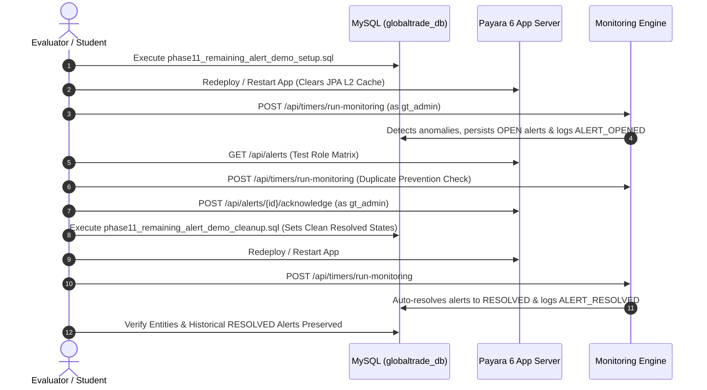

# Phase 11A: Supply Chain Alert Monitoring Demo Guide
## (Shipment Delays, Vendor Performance Risks & Customs Filing Deadlines)

This guide provides a deterministic, step-by-step procedure to demonstrate the automated supply chain monitoring engine, anomaly detection, idempotent duplicate prevention, fine-grained role-based visibility, alert acknowledgement, and automatic resolution across the remaining three alert categories.

---

## 1. Prerequisites & Environment
* **Application Context Root**: `http://localhost:8080/globaltrade`
* **Target Database**: `globaltrade_db`
* **Phase 11 Schema Migration**: Ensure `database/migrations/phase11_supply_chain_alerts.sql` has been executed once.

---

## 2. Step-by-Step Viva & Manual Demo Flow



---

### Step A: Seed Demo Anomaly Data in Database
Execute the setup script using MySQL CLI or MySQL Workbench:
```sql
mysql -u root -p globaltrade_db < "database/demo/phase11_remaining_alert_demo_setup.sql"
```

#### What this sets up:
1. **Shipment Delay**: Consignment `TRK-DEMO-11A-01` owned by `gt_customer` with `expected_delivery_date` 3 days in the past and status `IN_TRANSIT`.
2. **Vendor Performance Risk**: Temporarily updates Vendor #1 (`Pacific Cargo Ltd`, mapped to `gt_vendor`) rating to `2.65` (< `3.00` threshold), backing up the original `4.85` rating in `phase11_demo_vendor_backup`.
3. **Customs Document Deadline**: Declaration `DOC-DEMO-11A-01` (`IMPORT_DECLARATION`, status `SUBMITTED`) with `submission_deadline` 1 day in the past attached to `TRK-DEMO-11A-01`.

---

### Step B: Redeploy / Restart Application in Payara
> [!IMPORTANT]
> **Why is a server restart / redeploy required after direct SQL setup?**
> Payara's JPA persistence provider (EclipseLink) maintains a **shared Level-2 entity cache** in application memory. When database rows are updated directly via external SQL scripts (bypassing the JPA `EntityManager`), the in-memory cache may retain stale entity state.
> A quick redeploy or server restart synchronizes EclipseLink with the fresh database state. *(Note: This restart applies only to manual external SQL demonstrations; normal application transactions invalidate and refresh cache automatically).*

---

### Step C: Manually Trigger the Monitoring Cycle
Invoke the monitoring engine via Postman or `curl`:

* **URL**: `POST http://localhost:8080/globaltrade/api/timers/run-monitoring`
* **Authorization**: Basic Auth
  * **Username**: `gt_admin`
  * **Password**: `Password@123` *(or your local demo password)*
* **Expected Response (HTTP 200 OK)**:
```json
{
  "status": "SUCCESS",
  "triggerSource": "MANUAL_REST_TRIGGER",
  "successfulCategories": 4,
  "failedCategories": 0,
  "totalEntitiesEvaluated": 8,
  "totalActiveAlertsDetected": 3,
  "totalAlertsResolved": 0,
  "categories": [
    {
      "category": "SHIPMENT_DELAY",
      "success": true,
      "errorMessage": "",
      "entitiesEvaluated": 2,
      "activeAlertsDetected": 1,
      "alertsResolved": 0
    },
    {
      "category": "INVENTORY_REPLENISHMENT_REQUIRED",
      "success": true,
      "errorMessage": "",
      "entitiesEvaluated": 3,
      "activeAlertsDetected": 0,
      "alertsResolved": 0
    },
    {
      "category": "VENDOR_PERFORMANCE_RISK",
      "success": true,
      "errorMessage": "",
      "entitiesEvaluated": 3,
      "activeAlertsDetected": 1,
      "alertsResolved": 0
    },
    {
      "category": "CUSTOMS_DOCUMENT_DEADLINE",
      "success": true,
      "errorMessage": "",
      "entitiesEvaluated": 3,
      "activeAlertsDetected": 1,
      "alertsResolved": 0
    }
  ]
}
```

---

### Step D: Role-Based Alert Visibility Matrix Verification
Send `GET http://localhost:8080/globaltrade/api/alerts` using different role credentials:

| Caller Role | Username | Permitted Demo Alerts | Blocked Alerts |
| :--- | :--- | :--- | :--- |
| **Enterprise Admin** | `gt_admin` | `SHIPMENT_DELAY`<br>`VENDOR_PERFORMANCE_RISK`<br>`CUSTOMS_DOCUMENT_DEADLINE` | None (Global visibility) |
| **Logistics Coordinator** | `gt_coordinator` | `SHIPMENT_DELAY`<br>`VENDOR_PERFORMANCE_RISK`<br>`CUSTOMS_DOCUMENT_DEADLINE` | None (Operational visibility) |
| **Warehouse Manager** | `gt_warehouse` | `SHIPMENT_DELAY` | `VENDOR_PERFORMANCE_RISK`<br>`CUSTOMS_DOCUMENT_DEADLINE` |
| **Customs Agent** | `gt_customs` | `SHIPMENT_DELAY`<br>`CUSTOMS_DOCUMENT_DEADLINE` | `VENDOR_PERFORMANCE_RISK` |
| **Vendor Representative** | `gt_vendor` | `VENDOR_PERFORMANCE_RISK` (Only for Pacific Cargo #1) | `SHIPMENT_DELAY`<br>`CUSTOMS_DOCUMENT_DEADLINE`<br>Other vendors |
| **Consignment Customer** | `gt_customer` | `SHIPMENT_DELAY` (Only for own TRK-DEMO-11A-01) | `VENDOR_PERFORMANCE_RISK`<br>`CUSTOMS_DOCUMENT_DEADLINE`<br>Other customers |

---

### Step E: Idempotency & Duplicate Prevention Verification
1. Trigger the monitoring cycle a second time:
   `POST http://localhost:8080/globaltrade/api/timers/run-monitoring` (as `gt_admin`)
2. Verify that **zero duplicate alert records** were inserted into MySQL:
```sql
SELECT alert_key, alert_type, alert_status, COUNT(*) AS row_count, detected_at, last_detected_at
FROM supply_chain_alerts
GROUP BY alert_key, alert_type, alert_status, detected_at, last_detected_at;
```
*Expected Result*: Every `alert_key` has exactly `row_count = 1`. `last_detected_at` is updated to the latest timestamp without inserting additional rows.

---

### Step F: Alert Acknowledgement Demonstration
1. Identify the generated ID of the `OPEN` shipment delay alert (e.g. ID `1`):
```sql
SELECT id, alert_key, alert_status, message FROM supply_chain_alerts WHERE alert_status = 'OPEN';
```
2. Acknowledge the alert via REST:
   * **URL**: `POST http://localhost:8080/globaltrade/api/alerts/{id}/acknowledge`
   * **Authorization**: Basic Auth (`gt_admin` / `Password@123`)
3. Verify response:
```json
{
  "id": 1,
  "alertKey": "SHIPMENT_DELAY:...",
  "alertStatus": "ACKNOWLEDGED",
  "acknowledgedBy": "gt_admin"
}
```

---

### Step G: Automatic Alert Resolution & Preserved Entity History
To preserve full referential auditability, the cleanup script **does not delete** the business entities. Instead, it transitions them to clean, resolved operational states:

1. **Execute Cleanup Script**:
```sql
mysql -u root -p globaltrade_db < "database/demo/phase11_remaining_alert_demo_cleanup.sql"
```
   * Restores Vendor #1 performance rating from backup (`4.85`).
   * Marks `TRK-DEMO-11A-01` as `DELIVERED` with `actual_delivery_date = CURDATE()`.
   * Marks `DOC-DEMO-11A-01` as `APPROVED`.
   * Safely drops `phase11_demo_vendor_backup`.

2. **Redeploy / Restart Payara** (to invalidate EclipseLink shared cache).

3. **Trigger Monitoring Cycle**:
   `POST http://localhost:8080/globaltrade/api/timers/run-monitoring` (as `gt_admin`)

4. **Verify Alerts Transitioned to RESOLVED**:
```sql
SELECT alert_key, alert_type, alert_status, detected_at, resolved_at 
FROM supply_chain_alerts;
```
   *Expected Result*: All demo alert statuses are now `RESOLVED` with non-null `resolved_at` timestamps.

5. **Verify Business Entities Remain Present in Resolved States**:
```sql
SELECT tracking_number, shipment_status, actual_delivery_date FROM shipments WHERE tracking_number = 'TRK-DEMO-11A-01';
SELECT document_number, status FROM customs_documents WHERE document_number = 'DOC-DEMO-11A-01';
SELECT id, company_name, performance_rating FROM vendors WHERE id = 1;
```
   * `TRK-DEMO-11A-01` $\rightarrow$ `DELIVERED`
   * `DOC-DEMO-11A-01` $\rightarrow$ `APPROVED`
   * Vendor #1 $\rightarrow$ `4.85`

---

### Step H: Audit Trail Inspection
Inspect the immutable enterprise audit trail:
```sql
SELECT id, action, entity_type, entity_id, performed_by, timestamp, details
FROM audit_logs
WHERE action LIKE 'ALERT_%'
ORDER BY id ASC;
```

#### Expected Audit Sequence:
1. `ALERT_OPENED` — Logged once on initial anomaly detection.
2. `ALERT_ACKNOWLEDGED` — Logged when `gt_admin` acknowledged the open alert.
3. `ALERT_RESOLVED` — Logged when conditions cleared and monitoring ran.
4. **Zero spam**: Repeated cycles with unchanged conditions produced zero duplicate audit rows.
