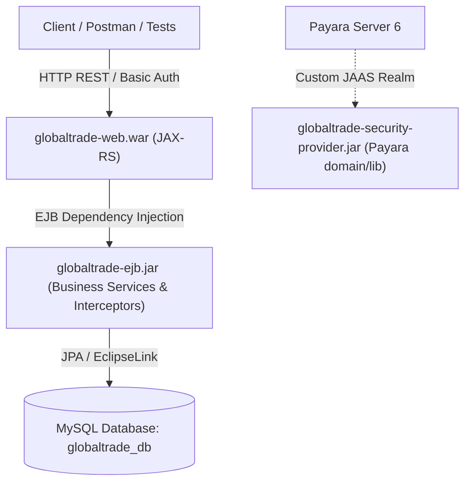
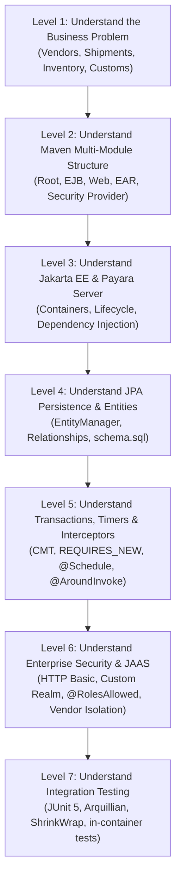

# GlobalTrade SCM — Student Learning Guide & Roadmap

Welcome to the **GlobalTrade Supply Chain Management (SCM)** project! This document is designed specifically as an entry point and learning roadmap for students who are new to enterprise Java, Jakarta EE, and distributed business systems.

---

## 1. What is GlobalTrade SCM?

**GlobalTrade SCM** is an enterprise-grade Supply Chain Management backend system. It models the core operations of an international logistics and trade enterprise:
- Registering international suppliers and vendors.
- Managing warehouse inventory stock levels across regions.
- Orchestrating multi-leg shipments from origin to destination.
- Verifying cross-border trade compliance and customs declarations.
- Enforcing strict, fine-grained access control (e.g., vendors can only view their own records).
- Auditing all business and security actions independently.
- Performing automated background monitoring and alert scheduling.

---

## 2. Why Does This System Exist?

In modern global logistics, business operations span across continents, warehouses, and independent legal entities. If a system updates shipment status but fails to deduct inventory, or if an audit record is lost during a server crash, businesses face severe financial and regulatory penalties.

GlobalTrade SCM was built to solve these real-world enterprise challenges:
1. **Data Integrity & Atomic Operations**: Ensuring multi-step business transactions (like shipment dispatch and stock deduction) succeed completely or fail cleanly without partial corruption.
2. **Audit Preservation**: Guaranteeing that security and operational audit logs survive and commit even when the main business transaction rolls back.
3. **Role-Based & Fine-Grained Security**: Protecting sensitive enterprise data using declarative roles and programmatic data-ownership rules.
4. **Automated Enterprise Timers**: Running scheduled background health checks and single-action tracking alerts without human intervention.
5. **Standardized Error Handling**: Preventing internal database errors and stack traces from leaking to external clients.

---

## 3. What Type of Application is This?

GlobalTrade SCM is a **Jakarta EE 10 Multi-Module Enterprise Application (EAR)** running on **Payara Server 6 (Community Edition)** and backed by a **MySQL** relational database.

It is structured into distinct Maven sub-modules:
- `globaltrade-security-provider`: Custom JAAS Realm and LoginModule deployed to the Payara server library.
- `globaltrade-ejb`: Core business logic, JPA entities, interceptors, timer beans, and integration tests.
- `globaltrade-web`: RESTful web APIs (JAX-RS), JSON DTOs, and exception mappers.
- `globaltrade-ear`: Enterprise Archive packaging the EJB JAR and Web WAR into a single deployable unit.

---

## 4. "Do Not Panic About These Terms Yet"

Here is a quick one-sentence preview of the major enterprise acronyms used in this project:

| Term | Full Form | One-Sentence Preview |
| :--- | :--- | :--- |
| **EJB** | Enterprise JavaBeans | Server-side Java components managed by the application server that provide built-in transaction management, security, and concurrency. |
| **JPA** | Jakarta Persistence API | A standard specification that maps Java classes (Entities) to database tables, eliminating manual SQL queries. |
| **JTA** | Jakarta Transactions API | The underlying transaction engine that ensures database operations follow ACID (Atomicity, Consistency, Isolation, Durability) rules. |
| **JAAS** | Java Authentication and Authorization Service | A pluggable security framework that allows custom authentication logic (like our custom realm) to integrate directly into the server. |
| **CMT** | Container-Managed Transactions | A mechanism where the application server automatically starts, commits, or rolls back database transactions based on Java annotations. |
| **BMT** | Bean-Managed Transactions | A mechanism where the developer writes explicit Java code (`utx.begin()`, `utx.commit()`) to manually manage transaction boundaries. |
| **EAR** | Enterprise Archive | A ZIP-formatted enterprise bundle (`.ear`) containing multiple modules (EJB JARs and Web WARs) deployed together. |
| **WAR** | Web Archive | A ZIP-formatted web bundle (`.war`) containing Servlets, JAX-RS REST resources, HTML pages, and web configuration files. |
| **JNDI** | Java Naming and Directory Interface | A directory service that allows Java components to discover and look up resources (such as database DataSources) by name. |
| **Arquillian** | Arquillian Integration Testing Framework | A testing framework that runs real JUnit 5 integration tests inside the actual running Payara application server. |

---

## 5. Beginner Learning Path (Levels 1 to 7)

To master this project for coursework, assessments, and technical vivas, follow this 7-level progressive learning roadmap:

### Level 1: Understand the Business Problem
- Read `docs/01_PROJECT_OVERVIEW.md` and `docs/02_FEATURES_AND_USE_CASES.md`.
- Learn what actions users perform (e.g. creating shipments, replenishing inventory, verifying customs).

### Level 2: Understand Modules & Packaging
- Read `docs/05_PROJECT_MODULE_STRUCTURE.md`.
- Understand why the project is divided into EJB, Web, EAR, and Security-Provider modules.

### Level 3: Understand Jakarta EE Architecture
- Read `docs/03_TECHNOLOGY_STACK.md` and `docs/04_SYSTEM_ARCHITECTURE.md`.
- Understand how Payara Server acts as the container providing services to our beans.

### Level 4: Understand Persistence & Business Logic
- Inspect `globaltrade-ejb/src/main/resources/META-INF/persistence.xml` and the entities in `globaltrade-ejb/src/main/java/com/jiat/globaltrade/entity/`.
- Understand how JPA maps database tables to Java objects.

### Level 5: Understand Transactions, Timers & Interceptors
- Inspect `ShipmentServiceBean.java`, `InventoryServiceBean.java`, and `AuditServiceBean.java`.
- Learn why `REQUIRES_NEW` is vital for audit trails.
- Inspect `SupplyChainMonitoringTimerBean.java` and `ShipmentAlertTimerBean.java`.
- Inspect the four interceptors in `globaltrade-ejb/src/main/java/com/jiat/globaltrade/interceptor/`.

### Level 6: Understand Security & JAAS
- Inspect `GlobalTradeCustomRealm.java` and `GlobalTradeLoginModule.java`.
- Inspect `VendorAuthorizationServiceBean.java` to see how fine-grained vendor access is enforced.

### Level 7: Understand Testing
- Inspect `globaltrade-ejb/src/test/java/com/jiat/globaltrade/test/`.
- Learn how Arquillian deploys test archives (`ShrinkWrap`) directly into Payara to prove that real JPA, CMT, interceptors, and JAAS security work as expected.

---

## 6. Recommended Documentation Reading Order

1. **`00_START_HERE.md`** *(This file)*: High-level orientation, learning roadmap, and terminology preview.
2. **`01_PROJECT_OVERVIEW.md`**: Business domain, system objectives, actors, and high-level workflows.
3. **`02_FEATURES_AND_USE_CASES.md`**: Detailed inventory of all implemented features, user roles, and business rules.
4. **`03_TECHNOLOGY_STACK.md`**: Comprehensive technology guide (WHAT, WHY, HOW, and WHERE).
5. **`04_SYSTEM_ARCHITECTURE.md`**: Layered architectural design, request lifecycles, and container services.
6. **`05_PROJECT_MODULE_STRUCTURE.md`**: Maven module anatomy, packaging, and deployment topology.

---

## 7. Recommended Source-Code Reading Order

When you are ready to explore the Java code, read the files in this logical sequence:

1. **Data Model (Entities & Schema)**:
   - `database/schema.sql`
   - `globaltrade-ejb/src/main/resources/META-INF/persistence.xml`
   - `globaltrade-ejb/src/main/java/com/jiat/globaltrade/entity/Vendor.java`
   - `globaltrade-ejb/src/main/java/com/jiat/globaltrade/entity/InventoryItem.java`
   - `globaltrade-ejb/src/main/java/com/jiat/globaltrade/entity/Shipment.java`
   - `globaltrade-ejb/src/main/java/com/jiat/globaltrade/entity/CustomsDocument.java`
   - `globaltrade-ejb/src/main/java/com/jiat/globaltrade/entity/AuditLog.java`
2. **Core Business Services**:
   - `globaltrade-ejb/src/main/java/com/jiat/globaltrade/service/SupplyChainDataService.java`
   - `globaltrade-ejb/src/main/java/com/jiat/globaltrade/service/InventoryServiceBean.java`
   - `globaltrade-ejb/src/main/java/com/jiat/globaltrade/service/ShipmentServiceBean.java`
   - `globaltrade-ejb/src/main/java/com/jiat/globaltrade/service/AuditServiceBean.java`
   - `globaltrade-ejb/src/main/java/com/jiat/globaltrade/service/InventoryReconciliationBean.java`
3. **Cross-Cutting Interceptors & Timers**:
   - `globaltrade-ejb/src/main/java/com/jiat/globaltrade/interceptor/BusinessValidationInterceptor.java`
   - `globaltrade-ejb/src/main/java/com/jiat/globaltrade/interceptor/TradeComplianceInterceptor.java`
   - `globaltrade-ejb/src/main/java/com/jiat/globaltrade/interceptor/PerformanceMonitoringInterceptor.java`
   - `globaltrade-ejb/src/main/java/com/jiat/globaltrade/interceptor/BusinessAuditInterceptor.java`
   - `globaltrade-ejb/src/main/java/com/jiat/globaltrade/timer/SupplyChainMonitoringTimerBean.java`
   - `globaltrade-ejb/src/main/java/com/jiat/globaltrade/timer/ShipmentAlertTimerBean.java`
4. **Security & Custom JAAS Realm**:
   - `globaltrade-security-provider/src/main/java/com/jiat/globaltrade/security/jaas/GlobalTradeCustomRealm.java`
   - `globaltrade-security-provider/src/main/java/com/jiat/globaltrade/security/jaas/GlobalTradeLoginModule.java`
   - `globaltrade-ejb/src/main/java/com/jiat/globaltrade/security/SecurityRoles.java`
   - `globaltrade-ejb/src/main/java/com/jiat/globaltrade/security/VendorAuthorizationServiceBean.java`
5. **REST API & Exception Handling**:
   - `globaltrade-web/src/main/java/com/jiat/globaltrade/web/RestApplication.java`
   - `globaltrade-web/src/main/java/com/jiat/globaltrade/web/dto/ApiErrorResponse.java`
   - `globaltrade-web/src/main/java/com/jiat/globaltrade/web/mapper/*ExceptionMapper.java`
   - `globaltrade-web/src/main/java/com/jiat/globaltrade/web/resource/*Resource.java`
6. **Integration Tests**:
   - `globaltrade-ejb/src/test/java/com/jiat/globaltrade/test/TestDeployments.java`
   - `globaltrade-ejb/src/test/java/com/jiat/globaltrade/test/PersistenceIntegrationIT.java`
   - `globaltrade-ejb/src/test/java/com/jiat/globaltrade/test/TransactionRollbackIntegrationIT.java`
   - `globaltrade-ejb/src/test/java/com/jiat/globaltrade/test/BusinessValidationInterceptorIT.java`
   - `globaltrade-ejb/src/test/java/com/jiat/globaltrade/test/SecurityAuthenticationIT.java`

---

## 8. Viva Preparation: Core Technologies to Focus On

During a viva examination, evaluators typically test your conceptual understanding and architectural reasoning rather than asking you to memorize code syntax. 

Be prepared to explain:
1. **Why multi-tier architecture?** Why not write database queries directly inside JAX-RS REST controllers? *(Separation of concerns, transaction demarcation, security boundaries, reusability).*
2. **How do CMT transactions work?** What is the difference between `REQUIRED`, `REQUIRES_NEW`, and `MANDATORY`? Why must `AuditServiceBean` use `REQUIRES_NEW`?
3. **How does Payara JAAS authentication work?** How does an incoming HTTP `Authorization: Basic` header reach `GlobalTradeLoginModule`, query MySQL, and translate into a `Principal` with roles?
4. **How is fine-grained authorization implemented?** Why is `@RolesAllowed` alone insufficient for restricting a vendor representative to only their own company's data?
5. **How does Arquillian test the application?** How does it differ from Mockito-based unit testing? *(Arquillian tests live container services: real JDBC DataSource, real CMT rollback, real JAAS realm).*
