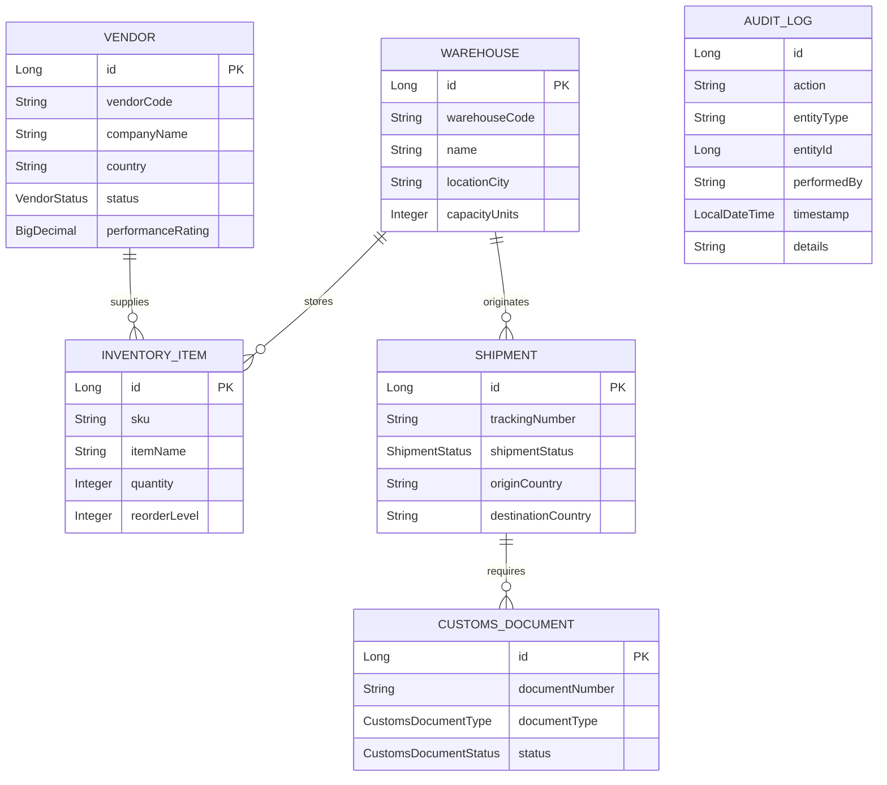

# GlobalTrade SCM — Project Overview

The **GlobalTrade Supply Chain Management (SCM)** system is an enterprise-grade backend platform engineered to coordinate international logistics, inventory control, vendor relationship management, and cross-border trade compliance.

---

## 1. Business Context & Problem Domain

### The Business Challenge
In modern international trade, goods move through a complex supply chain involving multiple stakeholders:
- Overseas manufacturers and vendors who supply merchandise.
- Regional warehouses that store and distribute goods.
- Customs authorities who mandate regulatory clearance before shipments can cross borders.
- Freight carriers and logistics coordinators who schedule dispatches.

Without a centralized, highly reliable enterprise system, logistics companies encounter severe operational pitfalls:
- **Inventory Discrepancies**: Dispatching shipments without atomically reserving or deducting warehouse stock leads to overselling and delayed deliveries.
- **Compliance Violations**: Shipping merchandise without valid customs documentation results in border confiscations and fines.
- **Security & Data Leaks**: Allowing third-party vendor representatives to see competitor pricing or inventory details destroys commercial trust.
- **Audit Trail Failure**: When a database failure occurs, vital security logs and transaction records can be lost if they are not isolated in autonomous transactions.

### The System Objective
GlobalTrade SCM provides a robust, transactional, role-secured platform that coordinates these operations with mathematical consistency, strict security boundaries, and automated monitoring.

---

## 2. Main Actors and Enterprise Roles

The system supports six distinct business actor roles and one internal system identity, defined in `globaltrade-ejb/src/main/java/com/jiat/globaltrade/security/SecurityRoles.java`:

| Actor Role | Role Name in System | Primary Responsibilities |
| :--- | :--- | :--- |
| **Enterprise Administrator** | `ADMIN` | Full administrative oversight, system health diagnostics, global vendor access, role management, and emergency overrides. |
| **Logistics Coordinator** | `LOGISTICS_COORDINATOR` | Schedules freight dispatches, manages vendor operational data, reviews shipment lifecycles across all warehouses. |
| **Customs Clearance Officer** | `CUSTOMS_AGENT` | Inspects and verifies customs documents (commercial invoices, bills of lading), grants customs clearances, ensures regulatory compliance. |
| **Warehouse Manager** | `WAREHOUSE_MANAGER` | Oversees warehouse stock levels, performs inventory replenishment, executes physically verified stock deductions. |
| **Vendor Representative** | `VENDOR_REPRESENTATIVE` | External partner representative with strictly isolated, fine-grained access to view and update only their assigned vendor profile. |
| **Consignment Customer** | `CUSTOMER` | External client who queries tracking milestones and shipment delivery status for their orders. |
| **Internal System Identity** | `SYSTEM` | Automated background actor for scheduled EJB timers, metrics gathering, and autonomous audit logging. |

---

## 3. Core Business Entities

The business domain is modeled using six primary JPA entities located in `globaltrade-ejb/src/main/java/com/jiat/globaltrade/entity/`:



1. **`Vendor`**: Represents international suppliers, tracking country of origin, contact details, operational status (`ACTIVE`, `SUSPENDED`, `UNDER_REVIEW`), and dynamic performance ratings (`0.00` to `5.00`).
2. **`Warehouse`**: Represents regional distribution centers with physical unit capacities and geographic locations.
3. **`InventoryItem`**: Tracks stock quantities per SKU, reorder warning thresholds, unit prices, and warehouse locations.
4. **`Shipment`**: Orchestrates cargo movement with tracking numbers, origin/destination countries, shipment statuses (`PENDING`, `DISPATCHED`, `IN_TRANSIT`, `DELIVERED`, `CANCELLED`), and scheduled departure/arrival dates.
5. **`CustomsDocument`**: Manages regulatory trade paperwork (commercial invoices, certificates of origin, import permits) and clearance states (`SUBMITTED`, `PENDING_REVIEW`, `APPROVED`, `REJECTED`).
6. **`AuditLog`**: Immutable ledger recording all significant business events, security decisions, and system operations with timestamps and caller identities.

---

## 4. Key Business Workflows (Input $\rightarrow$ Processing $\rightarrow$ Output)

### Workflow 1: Multi-Step Shipment Dispatch
- **Input**: Logistics Coordinator provides `shipmentId`, `inventoryItemId`, and `dispatchQuantity`.
- **Processing**:
  1. Container-Managed Transaction (CMT `REQUIRED`) begins.
  2. `BusinessValidationInterceptor` validates that `dispatchQuantity > 0`.
  3. `TradeComplianceInterceptor` checks that associated customs documents are in `APPROVED` status.
  4. `InventoryServiceBean.adjustStockInternal` (`MANDATORY`) checks available stock; if insufficient, throws `InsufficientInventoryException` triggering atomic rollback.
  5. `ShipmentServiceBean` updates shipment status to `DISPATCHED`.
  6. `AuditServiceBean.logAction` (`REQUIRES_NEW`) commits an independent audit entry.
- **Output**: Returns updated `Shipment` object with status `DISPATCHED` and decremented inventory stock.

### Workflow 2: Fine-Grained Vendor Portal Access
- **Input**: User authenticates with HTTP Basic credentials (`gt_vendor` / `Password@123`) and requests `GET /api/business-security/vendor/1`.
- **Processing**:
  1. Payara JAAS `GlobalTradeLoginModule` validates credentials and assigns `VENDOR_REPRESENTATIVE` role.
  2. `VendorAuthorizationServiceBean` checks `@RolesAllowed`.
  3. Service queries `vendor_user_access` mapping table to verify if `gt_vendor` owns Vendor #1.
  4. If mapped: returns Vendor #1 data. If caller tries to access Vendor #2: throws `VendorAccessDeniedException` (mapped to HTTP 403 Forbidden).
- **Output**: Returns Vendor JSON for authorized vendor; returns standardized 403 Forbidden error response for unauthorized vendor.

---

## 5. High-Level Technical Overview

GlobalTrade SCM is architected on enterprise standards:

```mermaid
graph TD
    subgraph ClientLayer["Client & Test Layer"]
        Postman["HTTP REST Clients / Postman"]
        Arquillian["Arquillian / JUnit 5 Integration Test Suite"]
    end

    subgraph PayaraServer["Payara Server 6 (Jakarta EE 10 Runtime)"]
        subgraph ServerLib["Payara Server Domain lib/"]
            JAAS["globaltrade-security-provider.jar<br/>(GlobalTradeCustomRealm & GlobalTradeLoginModule)"]
        end

        subgraph EAR["Enterprise Archive: globaltrade.ear"]
            subgraph WebModule["globaltrade-web.war (Presentation / JAX-RS)"]
                REST["JAX-RS Resource Endpoints"]
                Mappers["Centralized Exception Mappers"]
            end

            subgraph EJBModule["globaltrade-ejb.jar (Business Logic)"]
                EJBs["Stateless EJB Business Services"]
                Interceptors["Interceptor Pipeline (Validation, Compliance, Metrics, Audit)"]
                Timers["EJB Timer Services (Declarative & Programmatic)"]
                JPA["JPA / EclipseLink (GlobalTradePU)"]
            end
        end
    end

    subgraph DatabaseLayer["Data Tier"]
        DS["JNDI DataSource: jdbc/GlobalTradeDS"]
        MySQL[(MySQL Relational Database: globaltrade_db)]
    end

    Postman -->|HTTP Basic Auth / JSON| REST
    Arquillian -->|Remote Container Invocations| PayaraServer
    REST -->|@EJB Injection| EJBs
    EJBs --> Interceptors
    EJBs --> JPA
    Timers --> EJBs
    JPA --> DS
    DS --> MySQL
    PayaraServer -.->|JAAS Authentication Pipeline| JAAS
    JAAS -->|JDBC Validation| MySQL
```

### Key Technical Characteristics
- **Java 17 LTS**: Modern language features, records, enhanced switch statements, and robust runtime performance.
- **Jakarta EE 10**: Cloud-native enterprise standard including EJB 3.2/4.0, JPA 3.1, JAX-RS 3.1, and JTA 2.0.
- **Payara Server 6.2025.11**: High-performance, Jakarta EE 10-certified enterprise application server.
- **MySQL Database**: Production-ready relational database storing business entities, security credentials, and audit logs.
- **Multi-Module EAR Deployment**: Enterprise Archive (`globaltrade.ear`) packaging the EJB business module (`globaltrade-ejb.jar`) and the Web REST module (`globaltrade-web.war`) into a unified deployment unit.
- **Custom JAAS Realm**: Standalone security provider (`globaltrade-security-provider.jar`) installed in Payara's server library to authenticate credentials directly against salted database hashes.
- **In-Container Testing with Arquillian**: Automated test suites verifying real database connectivity, CMT transaction rollbacks, interceptor enforcement, and JAAS authentication directly inside the running Payara container.
