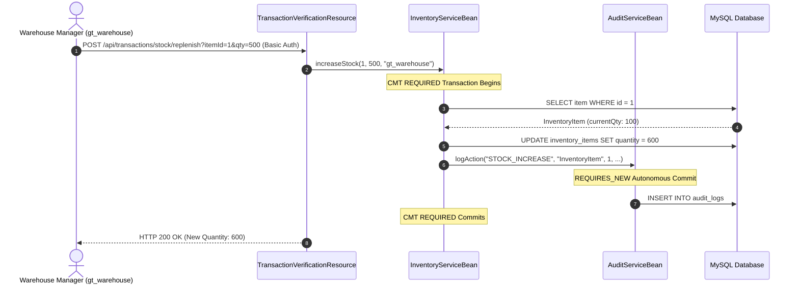
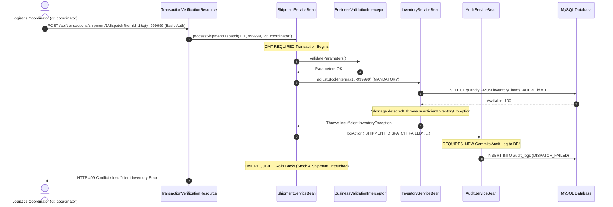
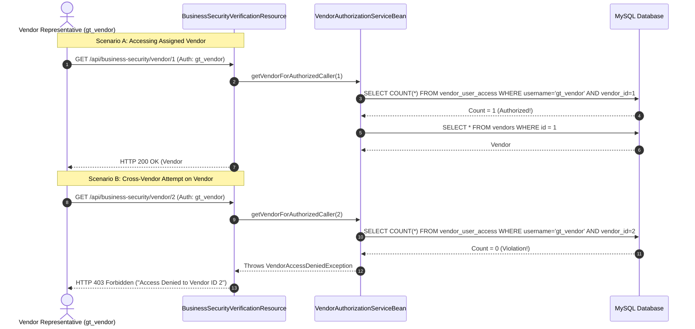

# GlobalTrade SCM — Features & Use Cases

This document provides a comprehensive catalogue of all implemented business features, technical capabilities, user roles, business rules, and realistic use cases in the GlobalTrade Supply Chain Management system.

---

## 1. Feature Catalogue by Functional Area

### 1.1 Vendor Management
- **Description**: Manages international vendor profiles, contact information, operational status, and vendor performance ratings.
- **Key Java Service**: `globaltrade-ejb/src/main/java/com/jiat/globaltrade/service/VendorServiceBean.java`
- **Authorized Roles**: `ADMIN`, `LOGISTICS_COORDINATOR` (write/rating updates); `VENDOR_REPRESENTATIVE` (read-only for own profile); `PERMIT_ALL` (general lookup).
- **Core Operations**:
  - `createVendor(Vendor vendor, String performedBy)`: Registers new international vendors.
  - `updatePerformanceRating(Long vendorId, BigDecimal newRating, String performedBy)`: Updates vendor rating with interceptor validation.
  - `updateVendorStatus(Long vendorId, VendorStatus newStatus, String performedBy)`: Toggles status (`ACTIVE`, `SUSPENDED`, `UNDER_REVIEW`).
  - `findActiveVendors()`: Returns all operational vendors.
- **Key Business Rules**:
  - Vendor performance ratings must fall strictly within `0.00` and `5.00` (enforced by `BusinessValidationInterceptor`).
  - Every status and rating mutation automatically generates an audit log record.

---

### 1.2 Inventory & Warehouse Stock Management
- **Description**: Tracks physical inventory levels across regional warehouses, processes stock replenishment and deductions, and monitors reorder warning thresholds.
- **Key Java Service**: `globaltrade-ejb/src/main/java/com/jiat/globaltrade/service/InventoryServiceBean.java` & `InventoryReconciliationBean.java`
- **Authorized Roles**: `ADMIN`, `WAREHOUSE_MANAGER` (write); `LOGISTICS_COORDINATOR` (read/query).
- **Core Operations**:
  - `increaseStock(Long itemId, int quantity, String performedBy)`: Replenishes stock for a SKU.
  - `decreaseStock(Long itemId, int quantity, String performedBy)`: Deducts stock with shortage validation.
  - `adjustStockInternal(Long itemId, int deltaQuantity)`: Atomic internal adjustment requiring an existing transaction (`MANDATORY`).
  - `isReorderLevelReached(Long itemId)`: Evaluates if stock is at or below threshold.
  - `reconcileWarehouseInventory(Long warehouseId)`: Programmatic BMT reconciliation verifying physical vs recorded stock.
- **Key Business Rules**:
  - Stock quantity can never become negative.
  - Attempting to deduct more stock than available immediately raises `InsufficientInventoryException` (`@ApplicationException(rollback = true)`), aborting the operation.

---

### 1.3 Shipment Orchestration
- **Description**: Coordinates multi-leg freight dispatches, tracks shipment lifecycles, and binds shipments to warehouse inventory and customs documentation.
- **Key Java Service**: `globaltrade-ejb/src/main/java/com/jiat/globaltrade/service/ShipmentServiceBean.java`
- **Authorized Roles**: `ADMIN`, `LOGISTICS_COORDINATOR`, `WAREHOUSE_MANAGER` (dispatch/cancel); `CUSTOMER` (tracking queries).
- **Core Operations**:
  - `createShipment(Shipment shipment, String performedBy)`: Creates new shipment in `PENDING` status.
  - `processShipmentDispatch(Long shipmentId, Long inventoryItemId, int dispatchQuantity, String performedBy)`: Multi-step atomic dispatch deducting stock, validating trade compliance, updating status to `DISPATCHED`, and logging audit.
  - `cancelShipment(Long shipmentId, String reason, String performedBy)`: Cancels pending shipment.
- **Key Business Rules**:
  - Shipment cannot be dispatched if associated customs documents are missing or rejected (`TradeComplianceInterceptor`).
  - Shipment cannot be dispatched if stock is insufficient (`InventoryServiceBean`).
  - Dispatch operation runs under Container-Managed Transaction `REQUIRED` so all sub-actions succeed or rollback together.

---

### 1.4 Trade Compliance & Customs Processing
- **Description**: Manages cross-border regulatory paperwork (Commercial Invoices, Bills of Lading, Certificates of Origin, Import Permits) and customs approvals.
- **Key Java Service**: `globaltrade-ejb/src/main/java/com/jiat/globaltrade/service/CustomsServiceBean.java`
- **Authorized Roles**: `ADMIN`, `CUSTOMS_AGENT`.
- **Core Operations**:
  - `submitCustomsDocument(CustomsDocument doc, String performedBy)`: Submits new customs document.
  - `approveCustomsDocument(Long documentId, String agentRemarks, String performedBy)`: Grants customs clearance.
  - `rejectCustomsDocument(Long documentId, String rejectionReason, String performedBy)`: Rejects customs document.
  - `isShipmentClearedForDispatch(Long shipmentId)`: Validates if all mandatory documents are `APPROVED`.
- **Key Business Rules**:
  - Unapproved or missing documents block freight dispatch at the interceptor layer (`TradeComplianceInterceptor`).

---

### 1.5 Autonomous Audit Logging
- **Description**: Provides an immutable, append-only security and operational audit trail.
- **Key Java Service**: `globaltrade-ejb/src/main/java/com/jiat/globaltrade/service/AuditServiceBean.java`
- **Authorized Roles**: `PERMIT_ALL` for write operations (accessible by all beans, interceptors, and timers); `ADMIN` for audit review.
- **Core Operations**:
  - `logAction(String action, String entityType, Long entityId, String performedBy, String details)`: Persists an audit entry under an autonomous `REQUIRES_NEW` transaction.
  - `getRecentLogs(int limit)`: Retrieves recent audit logs.
  - `getAuditLogCount()`: Returns total audit entries in the database.
- **Key Business Rules**:
  - Operates under `TransactionAttributeType.REQUIRES_NEW` so audit records commit immediately, even if the calling business transaction later encounters an exception and rolls back.

---

### 1.6 EJB Interceptor Framework
- **Description**: Decoupled, reusable cross-cutting interceptors that wrap business methods to enforce validation, compliance, latency metrics, and audit logging.
- **Key Java Classes** in `globaltrade-ejb/src/main/java/com/jiat/globaltrade/interceptor/`:
  - `BusinessValidationInterceptor`: Validates input arguments (ratings between `0.00` and `5.00`, quantities $> 0$).
  - `TradeComplianceInterceptor`: Validates customs document compliance before shipment dispatch.
  - `PerformanceMonitoringInterceptor`: Measures method execution latency and updates `InterceptorMetricsBean`.
  - `BusinessAuditInterceptor`: Automatically captures method execution details and delegates to `AuditServiceBean`.
- **Key Business Rules**:
  - Interceptors execute before and around business methods. If validation fails, interceptors throw runtime exceptions, stopping execution before business logic is touched.

---

### 1.7 EJB Timer Services
- **Description**: Automated, background scheduled task execution for enterprise monitoring and event-driven tracking alerts.
- **Key Java Classes** in `globaltrade-ejb/src/main/java/com/jiat/globaltrade/timer/`:
  - `SupplyChainMonitoringTimerBean`: Declarative persistent timer running every 15 minutes (`@Schedule(hour = "*", minute = "*/15", persistent = true)`) inspecting pending shipments and low-stock items.
  - `ShipmentAlertTimerBean`: Programmatic single-action timer service using `TimerService.createSingleActionTimer(durationMs, timerConfig)` creating deferred alerts for shipments.
- **Key Business Rules**:
  - Background timers execute autonomously under system identity without requiring external HTTP requests.

---

### 1.8 Custom JAAS Authentication & Fine-Grained RBAC
- **Description**: Server-side authentication and fine-grained data isolation.
- **Key Java Classes**:
  - `globaltrade-security-provider/.../GlobalTradeCustomRealm.java` & `GlobalTradeLoginModule.java`: Custom JAAS provider verifying credentials against MySQL `app_users` SHA-256 password hashes.
  - `globaltrade-ejb/.../VendorAuthorizationServiceBean.java`: Enforces both declarative `@RolesAllowed` and programmatic database checks (`vendor_user_access` table) to ensure vendor representatives can only access their assigned vendor data.
- **Key Business Rules**:
  - `gt_admin` and `gt_coordinator` possess enterprise-wide vendor access.
  - `gt_vendor` can only access Vendor #1 (mapped in `vendor_user_access`). Requesting Vendor #2 results in HTTP 403 Forbidden.

---

### 1.9 Centralized Enterprise Exception Handling
- **Description**: Translates Java and EJB exceptions into standardized, secure HTTP responses.
- **Key Java Classes** in `globaltrade-web/src/main/java/com/jiat/globaltrade/web/mapper/`:
  - `IllegalArgumentExceptionMapper` $\rightarrow$ **HTTP 400 Bad Request**
  - `VendorAccessDeniedExceptionMapper` / `EJBAccessExceptionMapper` $\rightarrow$ **HTTP 403 Forbidden**
  - `ResourceNotFoundExceptionMapper` $\rightarrow$ **HTTP 404 Not Found**
  - `InsufficientInventoryExceptionMapper` $\rightarrow$ **HTTP 409 Conflict**
  - `GenericExceptionMapper` $\rightarrow$ **HTTP 500 Internal Server Error** (sanitized, zero stack trace leakage)
  - `WebApplicationExceptionMapper` $\rightarrow$ Preserves standard HTTP status codes (e.g. 404 for unknown routes).

---

## 2. Realistic Project-Specific Use Cases

### Use Case 1: Warehouse Manager Replenishes Stock

---

### Use Case 2: Logistics Coordinator Dispatches Shipment (Rollback Scenario)

---

### Use Case 3: Vendor Representative Accesses Assigned Profile vs Cross-Vendor Data

---

### Use Case 4: Customs Agent Reviews and Approves Declaration
- **Actor**: Customs Clearance Officer (`gt_customs`).
- **Endpoint**: `POST /api/business-security/customs/1/review` (or EJB service call).
- **Flow**:
  1. `gt_customs` logs in via HTTP Basic Auth.
  2. Payara verifies `CUSTOMS_AGENT` role.
  3. `CustomsServiceBean.updateDocumentStatus` updates document status to `APPROVED`.
  4. Audit trail records `UPDATE_CUSTOMS_STATUS` with timestamp and agent remarks.
  5. The associated shipment is now eligible for international freight dispatch.

---

### Use Case 5: Background Monitoring Timer Executes Health Check
- **Actor**: Automatic System Timer (`SYSTEM`).
- **Trigger**: Every 5 minutes via `@Schedule(hour = "*", minute = "*/5", second = "0", persistent = true)`.
- **Flow**:
  1. Payara EJB Timer container wakes `SupplyChainMonitoringTimerBean.automaticMonitoringSchedule()`.
  2. Bean queries database for items with `quantity <= reorderLevel`.
  3. Bean queries pending shipments older than 48 hours.
  4. Formats monitoring summary and logs results.
  5. Records system audit entry via `AuditServiceBean`.
