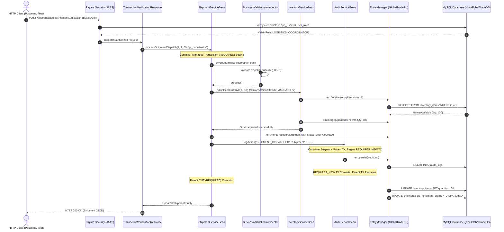

# GlobalTrade SCM — System Architecture Guide

This document describes the architectural layers, request lifecycles, container-managed services, and design principles of the GlobalTrade Supply Chain Management system.

---

## 1. Multi-Tier Enterprise Architecture

GlobalTrade SCM follows a classic **Multi-Tier Jakarta EE Enterprise Architecture**. Each tier has a distinct responsibility, ensuring high cohesion and loose coupling.

```mermaid
graph TD
    subgraph ClientTier["1. Client Tier"]
        Client["HTTP REST Clients / Postman / Mobile Apps"]
        TestClient["Arquillian JUnit 5 Integration Test Client"]
    end

    subgraph AppServer["2. Application Server: Payara Server 6.2025.11"]
        subgraph WebTier["Web Presentation Tier (globaltrade-web.war)"]
            AuthFilter["HTTP Basic Authentication Engine"]
            JAXRS["JAX-RS Resource Endpoints<br/>(/api/*)"]
            Mappers["Centralized Exception Mappers<br/>(400, 401, 403, 404, 409, 500)"]
        end

        subgraph SecurityTier["Security Tier (Server Lib & EJB)"]
            JAAS["GlobalTradeCustomRealm & LoginModule<br/>(Payara domain/lib)"]
            RBAC["Declarative RBAC (@RolesAllowed)"]
            FineGrained["VendorAuthorizationServiceBean<br/>(Fine-Grained Data Access)"]
        end

        subgraph EJBTier["Business Logic Tier (globaltrade-ejb.jar)"]
            EJBs["Stateless Business EJBs<br/>(Shipment, Inventory, Vendor, Audit, Customs)"]
            Interceptors["Interceptor Pipeline<br/>(Validation, Compliance, Metrics, Audit)"]
            Timers["EJB Timer Services<br/>(Declarative @Schedule & Programmatic AlertTimer)"]
        end

        subgraph PersistenceTier["Persistence Tier (JPA / EclipseLink)"]
            EM["EntityManager (GlobalTradePU)"]
            Entities["JPA Entities<br/>(Vendor, Warehouse, InventoryItem, Shipment, CustomsDoc, AuditLog)"]
        end
    end

    subgraph DatabaseTier["3. Database Tier"]
        JNDI["JNDI DataSource: jdbc/GlobalTradeDS"]
        MySQL[(MySQL Relational Database: globaltrade_db)]
    end

    Client -->|HTTP Request with Basic Auth| AuthFilter
    TestClient -->|HTTP / In-Container Invocations| AuthFilter
    AuthFilter -->|JAAS Pipeline| JAAS
    JAAS -->|SQL SHA-256 Auth & Role Query| MySQL
    AuthFilter -->|Authorized Principal| JAXRS
    JAXRS -->|@EJB Injection| EJBs
    JAXRS -.->|Maps Exceptions to JSON| Mappers
    EJBs --> RBAC
    RBAC --> FineGrained
    EJBs --> Interceptors
    Timers -->|Background Triggers| EJBs
    EJBs -->|@PersistenceContext| EM
    EM --> Entities
    EM --> JNDI
    JNDI --> MySQL
```

---

## 2. Detailed Architectural Tiers

### 2.1 Web Presentation Tier (`globaltrade-web.war`)
- **Responsibility**: Exposes HTTP RESTful endpoints, parses incoming JSON requests, invokes EJB business beans via `@EJB` dependency injection, and formats JSON responses.
- **Key Artifacts**:
  - `RestApplication.java`: JAX-RS bootstrap declaring `@ApplicationPath("/api")`.
  - Resource Classes (`TransactionVerificationResource.java`, `BusinessSecurityVerificationResource.java`, etc.).
  - Centralized Exception Mappers (`GenericExceptionMapper.java`, `InsufficientInventoryExceptionMapper.java`, etc.) translating Java exceptions into uniform HTTP status codes (`400`, `401`, `403`, `404`, `409`, `500`).

---

### 2.2 Security Tier
- **Responsibility**: Verifies caller identity and enforces role-based and fine-grained data-access rules.
- **Key Artifacts**:
  - `GlobalTradeCustomRealm.java` & `GlobalTradeLoginModule.java`: Standalone JAAS provider in Payara's `domain/lib` directory that verifies user passwords against SHA-256 hashes in the MySQL `app_users` table.
  - `SecurityRoles.java`: Centralized constants defining standard enterprise roles (`ADMIN`, `LOGISTICS_COORDINATOR`, `CUSTOMS_AGENT`, `WAREHOUSE_MANAGER`, `VENDOR_REPRESENTATIVE`, `CUSTOMER`, `SYSTEM`).
  - `VendorAuthorizationServiceBean.java`: Enforces both `@RolesAllowed` and programmatic database checks (`vendor_user_access` table) to isolate vendor representatives to their own company's data.

---

### 2.3 Business Logic Tier (`globaltrade-ejb.jar`)
- **Responsibility**: Implements core domain workflows, inventory calculations, shipment dispatches, and compliance checks.
- **Key Artifacts**:
  - Stateless Session Beans (`ShipmentServiceBean`, `InventoryServiceBean`, `VendorServiceBean`, `CustomsServiceBean`, `AuditServiceBean`, `SystemHealthBean`).
  - Bean-Managed Transaction Bean (`InventoryReconciliationBean`).

---

### 2.4 Interceptor Pipeline Tier
- **Responsibility**: Decoupled, aspect-oriented cross-cutting logic that wraps business EJB invocations.
- **Execution Order**:
  1. `BusinessValidationInterceptor`: Validates input arguments (e.g. ratings within `[0.00, 5.00]`, dispatch quantities $> 0$).
  2. `TradeComplianceInterceptor`: Validates customs document status for shipment operations.
  3. `PerformanceMonitoringInterceptor`: Times method execution duration and updates metrics in `InterceptorMetricsBean`.
  4. `BusinessAuditInterceptor`: Audits method execution via `AuditServiceBean` (`REQUIRES_NEW`).

---

### 2.5 Persistence Tier (JPA / EclipseLink)
- **Responsibility**: Manages entity lifecycles, Object-Relational Mapping (ORM), object caching, and JPQL queries.
- **Key Artifacts**:
  - `persistence.xml`: Defines persistence unit `GlobalTradePU` referencing JNDI DataSource `jdbc/GlobalTradeDS`.
  - Domain Entities (`Vendor`, `Warehouse`, `InventoryItem`, `Shipment`, `CustomsDocument`, `AuditLog`).

---

### 2.6 Database Tier (MySQL)
- **Responsibility**: Permanent, relational, ACID-compliant data storage.
- **Key Schema**: `database/schema.sql` (Tables: `vendors`, `warehouses`, `inventory_items`, `shipments`, `customs_documents`, `audit_logs`, `app_users`, `security_roles`, `user_roles`, `vendor_user_access`).

---

## 3. End-to-End REST Request Lifecycle

The diagram below traces an incoming HTTP request through all architectural layers during a multi-step shipment dispatch:



---

## 4. Container-Managed Services Supplied by Payara

A primary reason for using Jakarta EE and Payara Server instead of a lightweight web server is that Payara provides built-in enterprise services:

| Container Service | Description | Benefit in GlobalTrade SCM |
| :--- | :--- | :--- |
| **Dependency Injection** | `@EJB`, `@PersistenceContext`, `@Resource` | Eliminates manual instantiation (`new MyService()`). Beans are injected with thread safety and container proxying. |
| **Bean Lifecycle & Pooling** | Stateless EJB instance pooling | Payara maintains an optimized pool of EJB instances, handling high concurrency with minimal memory overhead. |
| **Transaction Management** | Declarative CMT via JTA | The container automatically starts, commits, or rolls back transactions based on annotations, preventing dirty reads or partial writes. |
| **Declarative Security** | `@RolesAllowed`, `@PermitAll` | Security checks are executed by container interceptors before method code executes. |
| **Enterprise Timers** | `@Schedule`, `TimerService` | Manages scheduled and delayed background jobs reliably, persisting timer states across server restarts. |
| **Persistence Integration** | JNDI connection pooling & EntityManager | Handles database connection pooling, statement caching, and transaction synchronization automatically. |

---

## 5. Why Not "REST Controller $\rightarrow$ Raw SQL"? (Separation of Concerns)

In novice applications, developers often write database queries directly inside web controllers. In enterprise systems, this approach fails:

```mermaid
graph LR
    subgraph AntiPattern["Anti-Pattern (Tightly Coupled)"]
        BadController["REST Controller"] -->|Manual SQL & JDBC| BadDB[(Database)]
    end

    subgraph EnterprisePattern["Enterprise Multi-Tier (GlobalTrade SCM)"]
        GoodREST["REST Resource (Web Tier)"] -->|@EJB Injection| GoodEJB["EJB Service (Business Tier)"]
        GoodEJB -->|CMT Transaction Boundary| GoodJPA["JPA / EntityManager (Data Tier)"]
        GoodJPA --> GoodDB[(Database)]
    end
```

### Key Architectural Reasons:
1. **Transaction Demarcation**: If a controller throws a JSON parsing error after running an `UPDATE` SQL statement, a direct-SQL design leaves corrupt data in the database. In GlobalTrade, CMT guarantees that the entire transaction rolls back cleanly.
2. **Security Isolation**: Business rules and data access must be enforced consistently whether the request originates from a REST endpoint, an automated timer, or an integration test. Placing logic in EJBs ensures universal security enforcement.
3. **Reusability & Testability**: EJB services can be tested in isolation using Arquillian without depending on HTTP network connections or mock frameworks.
4. **Audit Compliance**: Enterprise regulations require independent audit recording (`REQUIRES_NEW`), which is impossible to manage cleanly in monolithic controllers.
