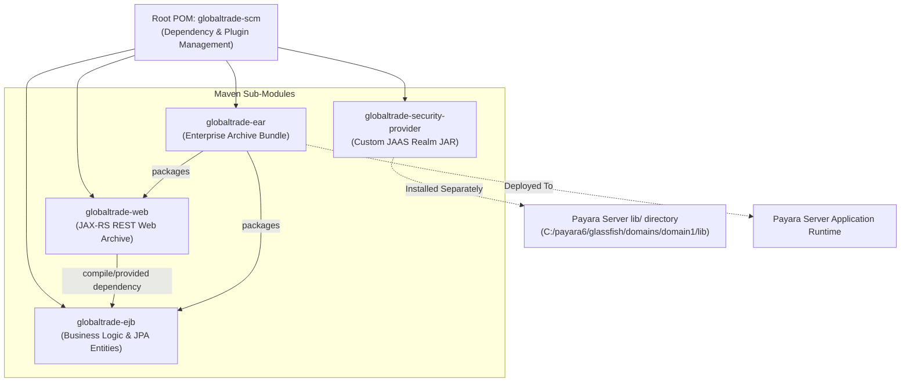

# GlobalTrade SCM — Project Module Structure Guide

This document describes the anatomy of the Apache Maven multi-module structure in the GlobalTrade Supply Chain Management system, explaining the purpose of each module, directory layouts, dependencies, classloader hierarchies, and packaging topologies.

---

## 1. Project Directory & Module Tree

```text
GlobalTradeSCM/
├── pom.xml                                      <-- Root Aggregator & Parent POM (packaging: pom)
├── database/
│   └── schema.sql                               <-- MySQL DDL Schema, Seed Data, and Demo Hashes
├── docs/                                        <-- Comprehensive System & Learning Documentation
│   ├── 00_START_HERE.md
│   ├── 01_PROJECT_OVERVIEW.md
│   ├── 02_FEATURES_AND_USE_CASES.md
│   ├── 03_TECHNOLOGY_STACK.md
│   ├── 04_SYSTEM_ARCHITECTURE.md
│   └── 05_PROJECT_MODULE_STRUCTURE.md
├── globaltrade-security-provider/               <-- Custom Payara JAAS Security Provider (packaging: jar)
│   ├── pom.xml
│   └── src/main/java/com/jiat/globaltrade/security/jaas/
│       ├── GlobalTradeCustomRealm.java          <-- Custom Payara AppservRealm
│       └── GlobalTradeLoginModule.java          <-- JAAS SHA-256 Password LoginModule
├── globaltrade-ejb/                             <-- Enterprise JavaBeans & Domain Logic (packaging: ejb)
│   ├── pom.xml
│   ├── src/main/java/com/jiat/globaltrade/
│   │   ├── entity/                              <-- JPA Entities (Vendor, Shipment, InventoryItem, etc.)
│   │   ├── entity/enums/                        <-- Entity State Enums (ShipmentStatus, VendorStatus, etc.)
│   │   ├── exception/                           <-- Application Exceptions (InsufficientInventoryException, etc.)
│   │   ├── interceptor/                         <-- EJB Interceptors (Validation, Compliance, Metrics, Audit)
│   │   ├── security/                            <-- Security Roles & VendorAuthorizationServiceBean
│   │   ├── service/                             <-- Stateless EJB Services (Shipment, Inventory, Audit, etc.)
│   │   └── timer/                               <-- EJB Timer Beans (Schedule & Alert Timers)
│   ├── src/main/resources/
│   │   ├── META-INF/persistence.xml             <-- JPA Persistence Unit (GlobalTradePU -> jdbc/GlobalTradeDS)
│   │   └── sql/schema.sql
│   └── src/test/                                <-- In-Container Arquillian Integration Test Suite
│       ├── java/com/jiat/globaltrade/test/
│       │   ├── AdminTestInvoker.java            <-- Test-Only @RunAs(ADMIN) Helper EJB
│       │   ├── ArquillianContainerSmokeIT.java  <-- Arquillian Deployment Smoke Test
│       │   ├── BusinessValidationInterceptorIT.java <-- Interceptor Validation Test
│       │   ├── PersistenceIntegrationIT.java    <-- JPA Live Database Test
│       │   ├── SecurityAuthenticationIT.java    <-- HTTP Basic / JAAS Security Test
│       │   ├── SecurityTestProbeServlet.java    <-- Test-Only Probe Endpoint Servlet
│       │   ├── TestDeployments.java             <-- ShrinkWrap Archive Factory
│       │   └── TransactionRollbackIntegrationIT.java <-- CMT Rollback & Audit Test
│       └── resources/arquillian.xml             <-- Arquillian Payara Remote Adapter Config
├── globaltrade-web/                             <-- REST Presentation & Exception Mappers (packaging: war)
│   ├── pom.xml
│   └── src/main/
│       ├── java/com/jiat/globaltrade/web/
│       │   ├── RestApplication.java             <-- JAX-RS Application Config (@ApplicationPath("/api"))
│       │   ├── dto/ApiErrorResponse.java        <-- Unified JSON Error Structure
│       │   ├── mapper/                          <-- JAX-RS Exception Mappers (400, 403, 404, 409, 500)
│       │   └── resource/                        <-- REST Endpoints (Security, Transactions, Timers, etc.)
│       └── webapp/
│           ├── WEB-INF/web.xml                  <-- Web Security Constraints & Basic Auth Realm Config
│           └── index.html                       <-- Web UI Landing Page
└── globaltrade-ear/                             <-- Enterprise Archive Bundle (packaging: ear)
    ├── pom.xml
    └── src/main/application/META-INF/
        └── glassfish-application.xml            <-- Payara Application-Level Realm & Role Mapping
```

---

## 2. Standard Maven Directory Layout Explained

For students learning Maven, understanding the standard folder conventions is essential:

| Directory Path | Role & Purpose | Included in Final Artifact? |
| :--- | :--- | :---: |
| **`src/main/java/`** | Production Java source code files (`.java`). Compiled into `.class` files in `target/classes/`. | **YES** |
| **`src/main/resources/`** | Production configuration files (`persistence.xml`, SQL scripts, properties). Copied directly into `target/classes/`. | **YES** |
| **`src/main/webapp/`** | Web application resources (`WEB-INF/web.xml`, HTML, JavaScript, CSS). Packaged into the root of the `.war` file. | **YES** *(WAR only)* |
| **`src/test/java/`** | Test source code (`*Test.java`, `*IT.java`, test helper classes). Compiled into `target/test-classes/`. | **NO** *(Test only)* |
| **`src/test/resources/`** | Test configuration files (`arquillian.xml`). Copied into `target/test-classes/`. | **NO** *(Test only)* |
| **`target/`** | **Generated build output**. Contains compiled classes, JARs, WARs, and EARs created by Maven during build. | **N/A** *(Build output)* |

---

## 3. Module Details & Architectural Roles



### 3.1 `globaltrade-scm` (Root Aggregator & Parent POM)
- **Packaging**: `pom`
- **Purpose**: Defines shared build properties (`<payara.home>`, `<jakartaee.version>`, `<junit.jupiter.version>`), centralized `<dependencyManagement>`, and lists all active child modules in `<modules>`.
- **Output**: Generates no standalone JAR; acts as the parent build coordinator.

---

### 3.2 `globaltrade-security-provider`
- **Packaging**: `jar`
- **Purpose**: Contains the custom Payara JAAS Security Realm (`GlobalTradeCustomRealm`) and Password Login Module (`GlobalTradeLoginModule`).
- **Dependencies**: Depends on Payara server internal libraries (`glassfish-ee-api.jar`, `security.jar`) with `<scope>system</scope>` pointing to `${payara.home}/glassfish/modules/...`.
- **Final Artifact**: `target/globaltrade-security-provider.jar`
- **Where it Runs**: **Installed directly in Payara Server's domain library** (`C:/payara6/glassfish/domains/domain1/lib/`).

#### Critical Architecture Note: Why is it NOT inside `globaltrade.ear`?
In Jakarta EE application servers, security realms are loaded by the **Server-Level ClassLoader** when the Payara domain starts up—*before* any individual application `.ear` is deployed. If `globaltrade-security-provider.jar` were packaged inside `globaltrade.ear`, Payara's security subsystem would not be able to find the class during server boot, causing authentication initialization to fail. Placing it in `domain/lib` makes the custom realm globally available to the server runtime.

---

### 3.3 `globaltrade-ejb`
- **Packaging**: `ejb` (built using `maven-ejb-plugin`)
- **Purpose**: Contains the core business logic, JPA domain entities, CMT/BMT services, interceptors, timer services, and the Arquillian integration test suite.
- **Dependencies**: Depends on `jakarta.jakartaee-api` (`provided`), JUnit 5 (`test`), Arquillian (`test`), and Payara Remote Arquillian Adapter (`test`).
- **Final Artifact**: `target/globaltrade-ejb.jar`
- **Where it Runs**: Packaged inside `globaltrade.ear` and executed in Payara's EJB container.

---

### 3.4 `globaltrade-web`
- **Packaging**: `war` (built using `maven-war-plugin`)
- **Purpose**: Presentation layer exposing JAX-RS REST endpoints, JSON error structures (`ApiErrorResponse`), exception mappers, and `web.xml` security constraints.
- **Dependencies**: Depends on `jakarta.jakartaee-api` (`provided`) and `globaltrade-ejb` (`provided` scope, as EJB classes are supplied by the EAR runtime).
- **Final Artifact**: `target/globaltrade-web.war`
- **Where it Runs**: Packaged inside `globaltrade.ear` with context root `/globaltrade`.

---

### 3.5 `globaltrade-ear`
- **Packaging**: `ear` (built using `maven-ear-plugin`)
- **Purpose**: Top-level enterprise distribution package that bundles `globaltrade-ejb.jar` and `globaltrade-web.war` into a single enterprise archive.
- **Final Artifact**: `target/globaltrade.ear`
- **Where it Runs**: Deployed directly to Payara Server 6 via IntelliJ Run Configuration or Payara Admin Console (`localhost:4848`).

---

## 4. Final Enterprise Archive (`globaltrade.ear`) Contents

When you run `jar tf globaltrade-ear/target/globaltrade.ear`, the archive contains:

```text
META-INF/
META-INF/MANIFEST.MF
META-INF/application.xml              <-- Standard Jakarta EE Application Descriptor
META-INF/glassfish-application.xml    <-- Payara Descriptor (Realm & Role Mappings)
globaltrade-ejb.jar                   <-- Production EJB Business Module
globaltrade-web.war                   <-- Production Web REST Module
```

### Key Structural Audit Points:
1. **Zero Test Contamination**: Test classes (`*IT.java`, `AdminTestInvoker.java`, `TestDeployments.java`) exist strictly in `globaltrade-ejb/src/test/` and are never packaged inside `globaltrade-ejb.jar` or `globaltrade.ear`.
2. **Clean Dependency Separation**: `globaltrade-web.war` depends on `globaltrade-ejb` with `<scope>provided</scope>`, ensuring the EJB JAR is not duplicated inside the WAR's `WEB-INF/lib`.
3. **Dedicated Server Security Provider**: `globaltrade-security-provider.jar` remains isolated in Payara's `domain/lib` directory.
