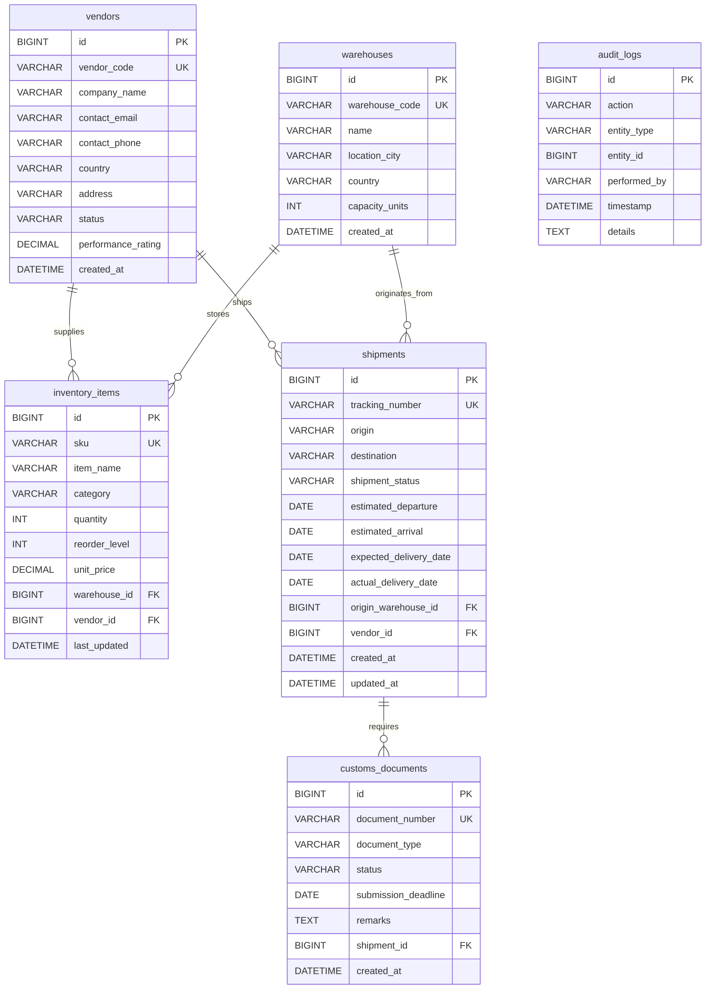
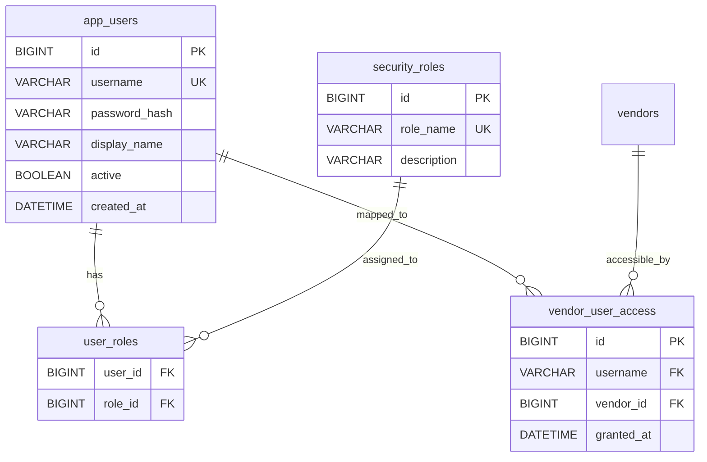

# GlobalTrade SCM — Database & Domain Model Guide

This document explains the core domain entities, relational database tables, entity relationships, security tables, and data flow in the GlobalTrade Supply Chain Management system.

---

## 1. Core Domain Modeling Concepts (Beginner Foundations)

Before exploring the code, it is important to understand the fundamental building blocks of enterprise data architecture:

| Concept | What It Is | Purpose in Enterprise Applications |
| :--- | :--- | :--- |
| **Domain Model** | The conceptual representation of real-world business objects, their data fields, and their rules in Java code. | Structures business information into object-oriented classes (`Vendor`, `Shipment`, `InventoryItem`). |
| **Entity** | A Java class annotated with `@Entity` representing a single persistent record in a database table. | Allows Java code to manipulate database rows as standard objects (`vendor.getCompanyName()`). |
| **Database Table** | A 2-dimensional grid of rows and columns stored in MySQL. | Persists enterprise data permanently on disk. |
| **Primary Key (PK)** | A column (or set of columns) whose value uniquely identifies every single row in a table (`id BIGINT AUTO_INCREMENT`). | Prevents duplicate records and allows fast, unambiguous lookups. |
| **Foreign Key (FK)** | A column in one table that references the Primary Key of another table (e.g. `vendor_id` in `inventory_items` referencing `id` in `vendors`). | Enforces relational integrity so orphaned or invalid records cannot be inserted. |

---

## 2. GlobalTrade Domain Entity Relationship Diagram

The diagram below illustrates the relational structure of the core business entities in `database/schema.sql` and `globaltrade-ejb/src/main/java/com/jiat/globaltrade/entity/`:

---

## 3. Core Business Entities Detailed Breakdown

### 3.1 `Vendor` (`vendors` table)
- **Class**: `com.jiat.globaltrade.entity.Vendor`
- **Purpose**: Represents an international supplier or manufacturing partner.
- **Key Fields**:
  - `id` (PK, `BIGINT AUTO_INCREMENT`): Unique system identifier.
  - `vendorCode` (Unique, `VARCHAR(30)`): Enterprise code (e.g. `VND-APEX-001`).
  - `companyName` (`VARCHAR(100)`): Legal entity name.
  - `status` (`@Enumerated(EnumType.STRING)`): Operational status mapped to `VendorStatus` enum (`ACTIVE`, `SUSPENDED`, `UNDER_REVIEW`).
  - `performanceRating` (`DECIMAL(3,2)`): Score from `0.00` to `5.00` reflecting delivery and quality reliability.
- **Relationships**:
  - `@OneToMany(mappedBy = "vendor") List<InventoryItem> inventoryItems`: Items supplied by this vendor.
  - `@OneToMany(mappedBy = "vendor") List<Shipment> shipments`: Shipments associated with this vendor.
- **Services Using It**: `VendorServiceBean`, `VendorAuthorizationServiceBean`, `SupplyChainDataService`.

---

### 3.2 `Warehouse` (`warehouses` table)
- **Class**: `com.jiat.globaltrade.entity.Warehouse`
- **Purpose**: Represents a physical storage and distribution hub in a geographic region.
- **Key Fields**:
  - `id` (PK, `BIGINT AUTO_INCREMENT`): Warehouse identifier.
  - `warehouseCode` (Unique, `VARCHAR(30)`): Code (e.g. `WH-SIN-01`, `WH-CMB-01`).
  - `name`, `locationCity`, `country`: Geographic metadata.
  - `capacityUnits` (`INT`): Total physical volume capacity.
- **Relationships**:
  - `@OneToMany(mappedBy = "warehouse") List<InventoryItem> inventoryItems`: Items stored in this warehouse.
  - `@OneToMany(mappedBy = "originWarehouse") List<Shipment> outboundShipments`: Shipments originating from this warehouse.
- **Services Using It**: `InventoryServiceBean`, `InventoryReconciliationBean`.

---

### 3.3 `InventoryItem` (`inventory_items` table)
- **Class**: `com.jiat.globaltrade.entity.InventoryItem`
- **Purpose**: Tracks inventory levels, SKUs, reorder thresholds, and unit costs.
- **Key Fields**:
  - `id` (PK, `BIGINT AUTO_INCREMENT`): Inventory item ID.
  - `sku` (Unique, `VARCHAR(50)`): Stock Keeping Unit (e.g. `SKU-ELEC-4091`).
  - `itemName` (`VARCHAR(100)`): Descriptive product name.
  - `quantity` (`INT`): Current on-hand quantity (cannot be negative).
  - `reorderLevel` (`INT`): Threshold triggering automated low-stock alerts when `quantity <= reorderLevel`.
  - `unitPrice` (`DECIMAL(10,2)`): Valuation per unit.
- **Relationships**:
  - `@ManyToOne @JoinColumn(name = "warehouse_id") Warehouse warehouse`: Location where physical stock is kept.
  - `@ManyToOne @JoinColumn(name = "vendor_id") Vendor vendor`: Supplier of the SKU.
- **Services Using It**: `InventoryServiceBean`, `ShipmentServiceBean`, `SupplyChainMonitoringTimerBean`.

---

### 3.4 `Shipment` (`shipments` table)
- **Class**: `com.jiat.globaltrade.entity.Shipment`
- **Purpose**: Orchestrates international freight movement across transit milestones.
- **Key Fields**:
  - `id` (PK, `BIGINT AUTO_INCREMENT`): Shipment ID.
  - `trackingNumber` (Unique, `VARCHAR(50)`): Public tracking code (e.g. `TRK-EXP-2026-001`).
  - `shipmentStatus` (`@Enumerated(EnumType.STRING)`): Lifecycle state mapped to `ShipmentStatus` enum (`PENDING`, `IN_TRANSIT`, `DELIVERED`, `CANCELLED`).
  - `origin`, `destination`: Country/port routing.
  - `expectedDeliveryDate`, `actualDeliveryDate`: Schedule vs actual delivery tracking.
- **Relationships**:
  - `@ManyToOne @JoinColumn(name = "origin_warehouse_id") Warehouse originWarehouse`: Dispatch source.
  - `@ManyToOne @JoinColumn(name = "vendor_id") Vendor vendor`: Partner supplier.
  - `@OneToMany(mappedBy = "shipment") List<CustomsDocument> customsDocuments`: Regulatory documents required for transit.
- **Services Using It**: `ShipmentServiceBean`, `ShipmentAlertTimerBean`, `SupplyChainMonitoringTimerBean`.

---

### 3.5 `CustomsDocument` (`customs_documents` table)
- **Class**: `com.jiat.globaltrade.entity.CustomsDocument`
- **Purpose**: Manages cross-border regulatory trade declarations and clearance status.
- **Key Fields**:
  - `id` (PK, `BIGINT AUTO_INCREMENT`): Document ID.
  - `documentNumber` (Unique, `VARCHAR(50)`): Reference number (e.g. `CD-2026-SG-001`).
  - `documentType` (`@Enumerated(EnumType.STRING)`): `CustomsDocumentType` enum (`COMMERCIAL_INVOICE`, `BILL_OF_LADING`, `CERTIFICATE_OF_ORIGIN`, `IMPORT_PERMIT`).
  - `status` (`@Enumerated(EnumType.STRING)`): `CustomsDocumentStatus` enum (`PENDING`, `SUBMITTED`, `APPROVED`, `REJECTED`).
  - `submissionDeadline` (`DATE`): Regulatory deadline for customs clearance.
- **Relationships**:
  - `@ManyToOne @JoinColumn(name = "shipment_id") Shipment shipment`: Associated cargo consignment.
- **Services Using It**: `CustomsServiceBean`, `TradeComplianceInterceptor`, `ShipmentAlertTimerBean`.

---

### 3.6 `AuditLog` (`audit_logs` table)
- **Class**: `com.jiat.globaltrade.entity.AuditLog`
- **Purpose**: Immutable ledger recording operational, transactional, and security actions.
- **Key Fields**:
  - `id` (PK, `BIGINT AUTO_INCREMENT`): Audit entry ID.
  - `action` (`VARCHAR(50)`): Event code (e.g. `SHIPMENT_DISPATCH_SUCCESS`, `DISPATCH_FAILED_INSUFFICIENT_STOCK`, `UPDATE_VENDOR_RATING`).
  - `entityType` (`VARCHAR(50)`): Target entity (`Shipment`, `Vendor`, `InventoryItem`, `CustomsDocument`).
  - `entityId` (`BIGINT`): Identifier of the affected record.
  - `performedBy` (`VARCHAR(50)`): Caller username or `SYSTEM`.
  - `timestamp` (`DATETIME`): Exact timestamp of event occurrence.
  - `details` (`TEXT`): Human-readable diagnostic details.
- **Services Using It**: `AuditServiceBean` (operates via `REQUIRES_NEW`), `BusinessAuditInterceptor`.

---

## 4. Security & Support Database Tables

In addition to core supply-chain business entities, `database/schema.sql` defines 4 dedicated tables supporting the Custom JAAS Realm and Fine-Grained Authorization:

1. **`app_users`**: Stores user accounts, active flags, and SHA-256 password hashes.
2. **`security_roles`**: Enumerates valid enterprise roles (`ADMIN`, `LOGISTICS_COORDINATOR`, `CUSTOMS_AGENT`, `WAREHOUSE_MANAGER`, `VENDOR_REPRESENTATIVE`, `CUSTOMER`, `SYSTEM`).
3. **`user_roles`**: Many-to-many join table mapping users to their assigned roles.
4. **`vendor_user_access`**: Fine-grained mapping table linking specific `username` accounts (such as `gt_vendor`) to specific `vendor_id` records (such as Vendor #1), preventing cross-vendor data exposure.

---

## 5. "Follow One Record" End-to-End Walkthrough

To see how domain entities interact across the database, follow the lifecycle of a real consignment:

1. **Vendor Registration**:
   - Record created in `vendors`: ID `1`, Code `VND-APEX-001`, Name `Apex Global Logistics`, Status `ACTIVE`.
   - Security mapping in `vendor_user_access`: User `gt_vendor` mapped to `vendor_id = 1`.
2. **Inventory Stocked**:
   - Record created in `inventory_items`: ID `1`, SKU `SKU-ELEC-4091`, Name `Industrial Controller`, Qty `100`, `vendor_id = 1`, `warehouse_id = 1`.
3. **Shipment Created**:
   - Record created in `shipments`: ID `1`, Tracking `TRK-EXP-2026-001`, Status `PENDING`, `origin_warehouse_id = 1`, `vendor_id = 1`.
4. **Customs Document Submitted**:
   - Record created in `customs_documents`: ID `1`, Doc `CD-2026-SG-001`, Type `COMMERCIAL_INVOICE`, Status `APPROVED`, `shipment_id = 1`.
5. **Shipment Dispatched**:
   - `ShipmentServiceBean.processShipmentDispatch(1, 1, 30, "gt_coordinator")` executes.
   - Stock in `inventory_items` (ID: 1) decrements from `100` to `70`.
   - Status in `shipments` (ID: 1) updates from `PENDING` to `IN_TRANSIT`.
6. **Audit Recorded**:
   - Record appended in `audit_logs`: Action `SHIPMENT_DISPATCH_SUCCESS`, Entity `Shipment#1`, User `gt_coordinator`, Details: `"Dispatched 30 units of SKU SKU-ELEC-4091. Shipment status: PENDING -> IN_TRANSIT"`.
