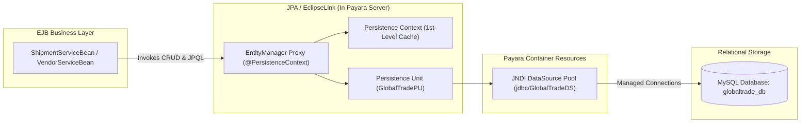

# GlobalTrade SCM — JPA Persistence Guide

This document teaches the Jakarta Persistence API (JPA) implementation in GlobalTrade SCM, explaining how Java objects map to relational database tables, how the `EntityManager` works, and how Payara coordinates database connectivity.

---

## 1. Why JPA? (JPA vs. Raw JDBC SQL)

In traditional Java applications, developers used standard **JDBC (Java Database Connectivity)**. In enterprise systems, writing raw JDBC leads to severe maintenance issues:

```java
// Traditional JDBC: Verbose, error-prone, tightly coupled to SQL dialect
Connection conn = DriverManager.getConnection(url, user, pass);
PreparedStatement ps = conn.prepareStatement("SELECT * FROM vendors WHERE id = ?");
ps.setLong(1, 1L);
ResultSet rs = ps.executeQuery();
if (rs.next()) {
    Vendor v = new Vendor();
    v.setId(rs.getLong("id"));
    v.setCompanyName(rs.getString("company_name"));
    // Manual mapping for 15+ fields...
}
rs.close(); ps.close(); conn.close(); // Risk of connection leaks if exceptions occur!
```

### The JPA Solution: Object-Relational Mapping (ORM)
**JPA** is an Object-Relational Mapping specification. It allows developers to interact with database records directly as Java objects:

```java
// Modern JPA in GlobalTrade SCM: Clean, safe, object-oriented
Vendor vendor = em.find(Vendor.class, 1L);
vendor.setPerformanceRating(new BigDecimal("4.85"));
// Payara automatically detects the change and updates the database upon transaction commit!
```

---

## 2. Core JPA Architectural Concepts



| Concept | Explanation |
| :--- | :--- |
| **Entity** | A Java class annotated with `@Entity` representing a table in MySQL. |
| **EntityManager** | The primary JPA interface providing methods (`persist`, `find`, `merge`, `remove`) to manage entity lifecycles. |
| **Persistence Context** | A first-level in-memory cache managed by the `EntityManager`. It tracks all entities loaded during a transaction to prevent duplicate database reads. |
| **Persistence Unit** | A named configuration block (`GlobalTradePU` in `persistence.xml`) grouping all managed entity classes and binding them to a DataSource. |
| **DataSource** | A Payara-managed connection pool (`jdbc/GlobalTradeDS`) providing pre-allocated, authenticated connections to MySQL. |
| **JNDI** | Java Naming and Directory Interface used by Payara to register and discover resources by name (e.g. `jdbc/GlobalTradeDS`). |

---

## 3. The `persistence.xml` Configuration

In GlobalTrade SCM, JPA is configured in `globaltrade-ejb/src/main/resources/META-INF/persistence.xml`:

```xml
<?xml version="1.0" encoding="UTF-8"?>
<persistence xmlns="https://jakarta.ee/xml/ns/persistence"
             xmlns:xsi="http://www.w3.org/2001/XMLSchema-instance"
             xsi:schemaLocation="https://jakarta.ee/xml/ns/persistence
                                 https://jakarta.ee/xml/ns/persistence/persistence_3_0.xsd"
             version="3.0">

    <persistence-unit name="GlobalTradePU" transaction-type="JTA">
        <description>GlobalTrade Supply Chain Management Persistence Unit</description>
        
        <!-- JNDI Resource binding managed by Payara Server -->
        <jta-data-source>jdbc/GlobalTradeDS</jta-data-source>

        <!-- Managed JPA Entity Classes -->
        <class>com.jiat.globaltrade.entity.Vendor</class>
        <class>com.jiat.globaltrade.entity.Warehouse</class>
        <class>com.jiat.globaltrade.entity.InventoryItem</class>
        <class>com.jiat.globaltrade.entity.Shipment</class>
        <class>com.jiat.globaltrade.entity.CustomsDocument</class>
        <class>com.jiat.globaltrade.entity.AuditLog</class>

        <properties>
            <!-- EclipseLink Logging & SQL Output -->
            <property name="eclipselink.logging.level" value="FINE"/>
            <property name="eclipselink.logging.parameters" value="true"/>
            
            <!-- Do not drop/create tables automatically; managed via schema.sql -->
            <property name="jakarta.persistence.schema-generation.database.action" value="none"/>
        </properties>
    </persistence-unit>
</persistence>
```

---

## 4. JPA Annotations Used in GlobalTrade SCM

Below are the annotations used across `globaltrade-ejb/src/main/java/com/jiat/globaltrade/entity/`:

### 4.1 `@Entity` and `@Table`
Declares that the Java class is a JPA entity and maps it to a specific database table:
```java
@Entity
@Table(name = "vendors")
public class Vendor implements Serializable { ... }
```

### 4.2 `@Id` and `@GeneratedValue`
Defines the primary key and delegates ID generation to MySQL's `AUTO_INCREMENT`:
```java
@Id
@GeneratedValue(strategy = GenerationType.IDENTITY)
@Column(name = "id", nullable = false, updatable = false)
private Long id;
```

### 4.3 `@Column`
Maps a Java property to a specific column with constraints:
```java
@Column(name = "vendor_code", nullable = false, unique = true, length = 30)
private String vendorCode;
```

### 4.4 `@Enumerated(EnumType.STRING)`
Stores the enum name as a readable string (`'ACTIVE'`) instead of an ordinal integer (`0`), preventing database corruption if enum constants are reordered:
```java
@Enumerated(EnumType.STRING)
@Column(name = "status", nullable = false, length = 20)
private VendorStatus status;
```

### 4.5 `@ManyToOne` and `@JoinColumn`
Maps a foreign key relationship from a child entity to a parent entity:
```java
// Inside InventoryItem.java: Foreign key column 'vendor_id' referencing vendors.id
@ManyToOne(fetch = FetchType.LAZY)
@JoinColumn(name = "vendor_id", nullable = false)
private Vendor vendor;
```

### 4.6 `@OneToMany(mappedBy = "...")`
Defines the inverse side of a relationship:
```java
// Inside Vendor.java: mappedBy points to the 'vendor' field in InventoryItem
@OneToMany(mappedBy = "vendor", fetch = FetchType.LAZY)
private List<InventoryItem> inventoryItems;
```

---

## 5. How Payara Injects `EntityManager` (`@PersistenceContext`)

Inside EJB business beans, developers do not instantiate the `EntityManager` using `new`. Instead, the application server injects a container-managed proxy:

```java
@Stateless
public class VendorServiceBean {

    @PersistenceContext(unitName = "GlobalTradePU")
    private EntityManager em;

    public Vendor findVendorById(Long id) {
        return em.find(Vendor.class, id);
    }
}
```

### Why `@PersistenceContext`?
1. **Thread Safety**: Payara automatically binds the `EntityManager` to the current transaction thread. Multiple concurrent requests never interfere with each other.
2. **Automatic Transaction Synchronization**: When an EJB method begins a JTA transaction, the `EntityManager` joins it automatically. When the method completes, Payara flushes changes and commits the transaction.
3. **No Connection Leaks**: Developers never write `conn.close()`. The server acquires connections from `jdbc/GlobalTradeDS` only when executing SQL and releases them immediately back to the pool.

---

## 6. Core `EntityManager` Operations Explained

### 6.1 `em.persist(entity)` (Insert)
Inserts a new object into the database.
```java
Shipment shipment = new Shipment();
shipment.setTrackingNumber("TRK-NEW-001");
em.persist(shipment); // Generates: INSERT INTO shipments (...) VALUES (...)
```

### 6.2 `em.find(Entity.class, primaryKey)` (Read by PK)
Loads an entity by its primary key. If already loaded in the Persistence Context cache, returns it without querying the database.
```java
Vendor vendor = em.find(Vendor.class, 1L); // Generates: SELECT * FROM vendors WHERE id = 1
```

### 6.3 `em.merge(entity)` (Update)
Synchronizes changes made to a detached or modified entity back into the database.
```java
vendor.setPerformanceRating(newRating);
em.merge(vendor); // Generates: UPDATE vendors SET performance_rating = ? WHERE id = ?
```

### 6.4 `em.createQuery(jpql, Entity.class)` (JPQL Queries)
Executes object-oriented queries referencing Java class names and properties rather than table and column names:
```java
List<Vendor> activeVendors = em.createQuery(
    "SELECT v FROM Vendor v WHERE v.status = :status ORDER BY v.companyName ASC", Vendor.class)
    .setParameter("status", VendorStatus.ACTIVE)
    .getResultList();
```

### 6.5 `em.createNativeQuery(sql)` (Native SQL)
Used when executing raw SQL queries (such as cross-table counts for fine-grained authorization):
```java
Number count = (Number) em.createNativeQuery(
    "SELECT COUNT(*) FROM vendor_user_access WHERE username = ?1 AND vendor_id = ?2")
    .setParameter(1, username)
    .setParameter(2, vendorId)
    .getSingleResult();
```

---

## 7. Beginner Summary: JPA vs. JDBC vs. MySQL

| Feature | MySQL | JDBC | JPA (EclipseLink) |
| :--- | :--- | :--- | :--- |
| **What is it?** | Database server storing tables on disk | Java API for sending raw SQL strings | Object-Relational Mapping framework |
| **Data representation** | Rows and columns | `ResultSet` rows | Standard Java Objects (`Entities`) |
| **Query syntax** | Raw SQL (`SELECT * FROM vendors`) | Raw SQL in strings | Object-oriented JPQL (`SELECT v FROM Vendor v`) |
| **Connection management** | Listens on port `3306` | Developer must open/close manually | Managed automatically by Payara connection pool |
| **Data caching** | Database buffer pool | None | First-Level Persistence Context cache |
| **Type safety** | SQL data types | Weak (manual column casting) | Strong (compiler-verified Java types) |
