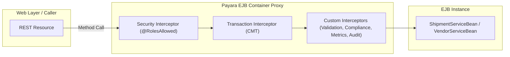
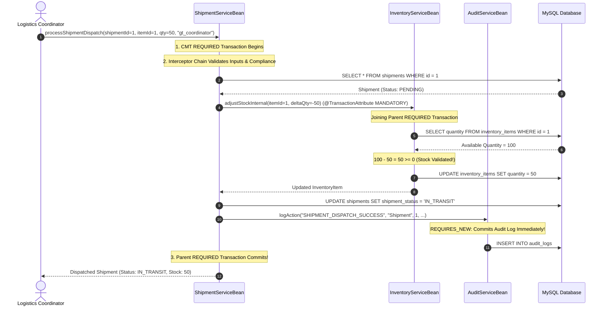

# GlobalTrade SCM — EJB Services & Business Logic Guide

This document explains the business logic layer in GlobalTrade SCM. It details what Enterprise JavaBeans (EJBs) are, why they are used, how each business service operates, and walks through key multi-step workflows with sequence diagrams.

---

## 1. Enterprise JavaBeans (EJB) Foundations

### 1.1 What is an EJB?
An **Enterprise JavaBean (EJB)** is a server-managed Java component. Unlike standard Java objects (`new MyService()`), an EJB instance is instantiated, pooled, secured, and managed by Payara Server.

### 1.2 Why Not Just Normal Java Classes (POJOs)?
If you use standard Java classes, you must write manual code for:
- Beginning and committing database transactions.
- Checking user permissions and login roles before each method.
- Managing thread safety and object lifecycles.
- Coordinating rollbacks when unexpected runtime errors occur.

With EJBs, **Payara Server automatically wraps your bean with container interceptors** that handle transactions, security, and concurrency transparently based on annotations.



---

## 2. Key EJB Annotations Used in the Project

| Annotation | What It Does in GlobalTrade SCM |
| :--- | :--- |
| **`@Stateless`** | Declares a Stateless Session Bean. The bean holds no client-specific state between calls and can be pooled by Payara to serve thousands of concurrent requests. |
| **`@EJB`** | Injects a reference to another EJB. Payara injects a container-managed proxy rather than a raw object. |
| **`@RolesAllowed({...})`** | Restricts method execution to callers possessing specific roles (`ADMIN`, `LOGISTICS_COORDINATOR`, etc.). |
| **`@PermitAll`** | Allows any authenticated or unauthenticated caller to invoke the method. |
| **`@TransactionAttribute(...)`** | Controls how the method participates in JTA transactions (`REQUIRED`, `MANDATORY`, `REQUIRES_NEW`, `SUPPORTS`). |
| **`@Interceptors({...})`** | Binds custom cross-cutting interceptors to execute before and after the method. |
| **`@Resource SessionContext`** | Injects runtime context allowing the bean to query the caller's identity (`sessionContext.getCallerPrincipal()`) or check roles programmatically (`sessionContext.isCallerInRole(...)`). |

---

## 3. Detailed Service Breakdown

### 3.1 `VendorServiceBean`
- **Location**: `globaltrade-ejb/src/main/java/com/jiat/globaltrade/service/VendorServiceBean.java`
- **Responsibility**: Manages vendor lifecycles, operational statuses, and performance ratings.
- **Interceptors**: Bound at class-level: `BusinessValidationInterceptor`, `PerformanceMonitoringInterceptor`, `BusinessAuditInterceptor`.
- **Key Methods**:
  - `findVendorById(Long id)`: `@PermitAll`, `@TransactionAttribute(SUPPORTS)`.
  - `findAllVendors()`: `@RolesAllowed({ADMIN, LOGISTICS_COORDINATOR})`, `@TransactionAttribute(SUPPORTS)`.
  - `updateVendorStatus(Long id, VendorStatus status, String caller)`: `@RolesAllowed(ADMIN)`, `@TransactionAttribute(REQUIRED)`.
  - `updatePerformanceRating(Long id, BigDecimal rating, String caller)`: `@RolesAllowed({ADMIN, LOGISTICS_COORDINATOR})`, `@TransactionAttribute(REQUIRED)`.
- **Business Rule**: Performance rating must be within `[0.00, 5.00]`. If outside range, `BusinessValidationInterceptor` throws `IllegalArgumentException`.

---

### 3.2 `InventoryServiceBean`
- **Location**: `globaltrade-ejb/src/main/java/com/jiat/globaltrade/service/InventoryServiceBean.java`
- **Responsibility**: Warehouse inventory tracking, stock replenishment, and stock allocation.
- **Key Methods**:
  - `findInventoryItemById(Long id)`: `@PermitAll`, `@TransactionAttribute(SUPPORTS)`.
  - `increaseStock(Long itemId, int quantity, String caller)`: `@RolesAllowed({ADMIN, WAREHOUSE_MANAGER})`, `@TransactionAttribute(REQUIRED)`. Adds stock and logs audit.
  - `decreaseStock(Long itemId, int quantity, String caller)`: `@RolesAllowed({ADMIN, WAREHOUSE_MANAGER})`, `@TransactionAttribute(REQUIRED)`. Deducts stock; throws `InsufficientInventoryException` if stock is low.
  - `adjustStockInternal(Long itemId, int deltaQuantity)`: `@PermitAll`, `@TransactionAttribute(MANDATORY)`. Internal atomic adjustment method called by orchestrators (like `ShipmentServiceBean`). **Must be called within an existing transaction.**
  - `isReorderLevelReached(Long itemId)`: Evaluates if stock is at or below threshold.

---

### 3.3 `ShipmentServiceBean`
- **Location**: `globaltrade-ejb/src/main/java/com/jiat/globaltrade/service/ShipmentServiceBean.java`
- **Responsibility**: Orchestrates freight creation, status transitions, and atomic shipment dispatching.
- **Key Methods**:
  - `createShipment(Shipment shipment, Long vendorId, String caller)`: `@RolesAllowed({ADMIN, LOGISTICS_COORDINATOR})`, `@TransactionAttribute(REQUIRED)`.
  - `updateShipmentStatus(Long id, ShipmentStatus status, String caller)`: `@RolesAllowed({ADMIN, LOGISTICS_COORDINATOR})`, `@TransactionAttribute(REQUIRED)`.
  - `processShipmentDispatch(Long shipmentId, Long itemId, int qty, String caller)`: `@RolesAllowed({ADMIN, LOGISTICS_COORDINATOR, WAREHOUSE_MANAGER})`, `@TransactionAttribute(REQUIRED)`.
    - Bound Interceptors: `BusinessValidationInterceptor`, `TradeComplianceInterceptor`, `PerformanceMonitoringInterceptor`, `BusinessAuditInterceptor`.
    - Coordinates stock deduction via `inventoryService.adjustStockInternal` (`MANDATORY`).
    - Catches `InsufficientInventoryException`, logs failure via `auditService.logAction` (`REQUIRES_NEW`), and rethrows to trigger outer transaction rollback.

---

### 3.4 `CustomsServiceBean`
- **Location**: `globaltrade-ejb/src/main/java/com/jiat/globaltrade/service/CustomsServiceBean.java`
- **Responsibility**: Manages regulatory customs declarations, approvals, and compliance verification.
- **Key Methods**:
  - `createCustomsDocument(CustomsDocument doc, Long shipmentId, String caller)`: `@RolesAllowed({ADMIN, CUSTOMS_AGENT})`, `@TransactionAttribute(REQUIRED)`.
  - `updateDocumentStatus(Long id, CustomsDocumentStatus status, String caller)`: `@RolesAllowed({ADMIN, CUSTOMS_AGENT})`, `@TransactionAttribute(REQUIRED)`.
  - `findDocumentsByShipment(Long shipmentId)`: `@RolesAllowed({ADMIN, CUSTOMS_AGENT, LOGISTICS_COORDINATOR})`, `@TransactionAttribute(SUPPORTS)`.

---

### 3.5 `AuditServiceBean`
- **Location**: `globaltrade-ejb/src/main/java/com/jiat/globaltrade/service/AuditServiceBean.java`
- **Responsibility**: Provides autonomous, tamper-proof audit trail logging.
- **Key Methods**:
  - `logAction(String action, String entityType, Long entityId, String caller, String details)`: `@PermitAll`, `@TransactionAttribute(REQUIRES_NEW)`.
    - **Crucial Architecture**: Suspends any active caller transaction and commits the audit record in an independent transaction. This ensures audit records are preserved even if the caller's transaction later rolls back!
  - `getRecentLogs(int limit)` / `getAuditLogCount()`: `@PermitAll`, `@TransactionAttribute(SUPPORTS)`.

---

### 3.6 `VendorAuthorizationServiceBean`
- **Location**: `globaltrade-ejb/src/main/java/com/jiat/globaltrade/security/VendorAuthorizationServiceBean.java`
- **Responsibility**: Enforces fine-grained data isolation on vendor records.
- **Key Methods**:
  - `isCallerAuthorizedForVendor(Long vendorId)`: Uses `SessionContext` to check if caller is `ADMIN` / `LOGISTICS_COORDINATOR` (granted globally) or `VENDOR_REPRESENTATIVE` (checks database mapping in `vendor_user_access`).
  - `getVendorForAuthorizedCaller(Long vendorId)`: `@RolesAllowed({ADMIN, LOGISTICS_COORDINATOR, VENDOR_REPRESENTATIVE})`. Throws `VendorAccessDeniedException` if caller does not own the requested vendor ID.

---

### 3.7 `InventoryReconciliationBean`
- **Location**: `globaltrade-ejb/src/main/java/com/jiat/globaltrade/service/InventoryReconciliationBean.java`
- **Responsibility**: Programmatic Bean-Managed Transaction (BMT) reconciliation.
- **Key Methods**:
  - `reconcilePhysicalCount(Long itemId, int physicalCount, int threshold, String caller)`: `@TransactionManagement(BEAN)`.
  - Injects `UserTransaction utx`. Starts transaction explicitly (`utx.begin()`). If variance exceeds allowable threshold, rolls back programmatically (`utx.rollback()`) and logs rejected audit; otherwise commits (`utx.commit()`).

---

### 3.8 `SupplyChainDataService`
- **Location**: `globaltrade-ejb/src/main/java/com/jiat/globaltrade/service/SupplyChainDataService.java`
- **Responsibility**: System health, database connectivity checks (`SELECT 1`), and total vendor entity counting.

---

## 4. Key Business Workflow Walkthroughs

### Workflow 1: Vendor Performance Rating Update
```mermaid
sequenceDiagram
    autonumber
    actor Caller as Admin / Coordinator
    participant Proxy as Payara Container Proxy
    participant ValInterceptor as BusinessValidationInterceptor
    participant PerfInterceptor as PerformanceMonitoringInterceptor
    participant AuditInterceptor as BusinessAuditInterceptor
    participant VendorService as VendorServiceBean
    participant EM as EntityManager
    participant AuditService as AuditServiceBean
    participant DB as MySQL

    Caller->>Proxy: updatePerformanceRating(1, 4.85, "gt_coordinator")
    Proxy->>Proxy: Verify @RolesAllowed({ADMIN, LOGISTICS_COORDINATOR})
    Proxy->>ValInterceptor: @AroundInvoke validateArguments()
    ValInterceptor->>ValInterceptor: Check rating within [0.00, 5.00]
    ValInterceptor->>PerfInterceptor: context.proceed()
    PerfInterceptor->>PerfInterceptor: Record start nanoTime
    PerfInterceptor->>AuditInterceptor: context.proceed()
    AuditInterceptor->>VendorService: context.proceed()
    
    Note over VendorService: CMT REQUIRED Transaction Active
    VendorService->>EM: em.find(Vendor.class, 1)
    EM->>DB: SELECT * FROM vendors WHERE id = 1
    DB-->>EM: Vendor (Old Rating: 4.20)
    VendorService->>EM: vendor.setPerformanceRating(4.85); em.merge(vendor)
    VendorService->>AuditService: logAction("UPDATE_VENDOR_RATING", ...)
    Note over AuditService: REQUIRES_NEW Commits Audit Log
    AuditService->>DB: INSERT INTO audit_logs
    
    VendorService-->>AuditInterceptor: return updated Vendor
    AuditInterceptor->>AuditService: logAction("INTERCEPTOR_BUSINESS_SUCCESS", ...)
    AuditInterceptor-->>PerfInterceptor: return
    PerfInterceptor->>PerfInterceptor: Compute duration & update metrics
    PerfInterceptor-->>ValInterceptor: return
    ValInterceptor-->>Proxy: return
    Note over Proxy: CMT REQUIRED Commits to DB
    EM->>DB: UPDATE vendors SET performance_rating = 4.85 WHERE id = 1
    Proxy-->>Caller: HTTP 200 OK (Updated Vendor)
```

---

### Workflow 2: Multi-Step Shipment Dispatch Orchestration
The exact execution sequence inside `ShipmentServiceBean.processShipmentDispatch`:


