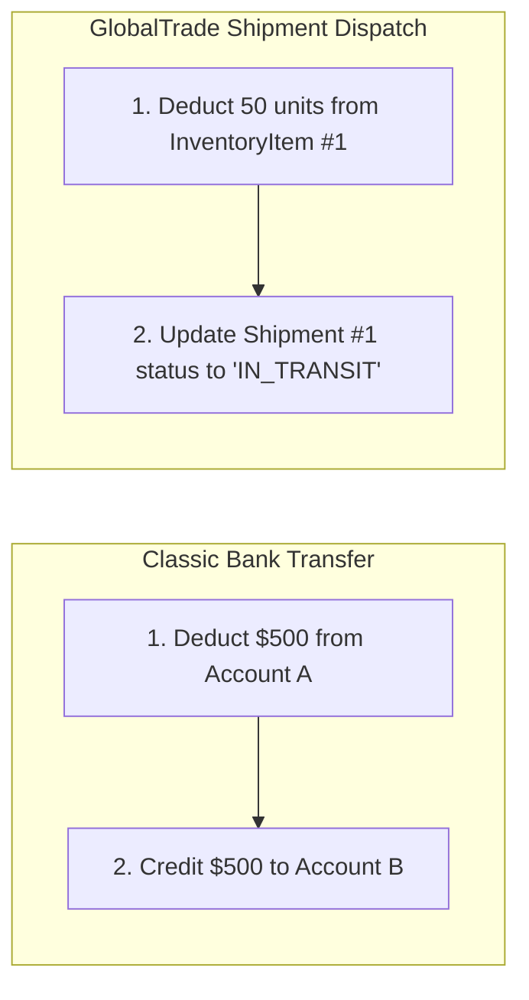
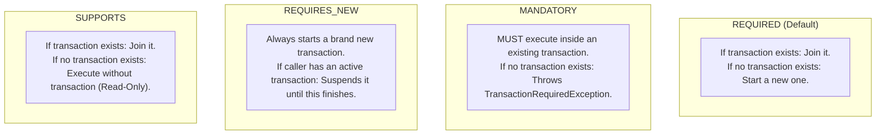
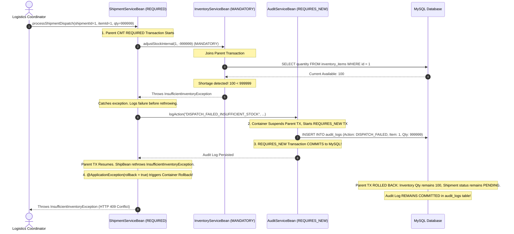

# GlobalTrade SCM — Transaction Management Guide

This document is an in-depth guide to transaction management in GlobalTrade SCM. It explains ACID transactions, Container-Managed Transactions (CMT), Bean-Managed Transactions (BMT), transaction attributes, rollback rules, and why audit logs survive rollbacks.

---

## 1. Transaction Foundations (Beginner Overview)

### 1.1 What is a Transaction?
A **transaction** is a sequence of one or more database operations treated as a single, indivisible unit of work.

Transactions must satisfy the **ACID** properties:
- **Atomicity**: "All or nothing." Either every operation succeeds and commits, or if any step fails, all previous operations are completely undone (rolled back).
- **Consistency**: The database moves from one valid state to another, obeying all constraints.
- **Isolation**: Concurrent transactions cannot see each other's partial, uncommitted changes.
- **Durability**: Once committed, changes are permanently saved on disk even if the server crashes.

### 1.2 The Classic Analogy vs. GlobalTrade SCM



If Step 1 succeeds (stock deducted) but Step 2 fails (e.g. invalid customs documentation or server error), an atomic transaction **rolls back Step 1**, restoring the stock quantity back to its original value.

---

## 2. CMT vs. BMT (Container-Managed vs. Bean-Managed Transactions)

Jakarta EE provides two transaction management models:

| Feature | Container-Managed Transactions (CMT) | Bean-Managed Transactions (BMT) |
| :--- | :--- | :--- |
| **How boundaries are defined** | Declaratively using annotations (`@TransactionAttribute`) | Programmatically using `UserTransaction` API (`utx.begin()`, `utx.commit()`, `utx.rollback()`) |
| **Who manages commit/rollback** | **Payara Server container** automatically manages boundaries | **Developer code** explicitly calls commit/rollback |
| **Boilerplate code** | Zero boilerplate | Requires try-catch blocks and error handling |
| **Risk of resource leaks** | Very low | Higher if developer forgets to rollback on exception |
| **Where used in GlobalTrade** | **Standard across all business services** (`ShipmentServiceBean`, `InventoryServiceBean`, `VendorServiceBean`, `AuditServiceBean`) | **Specialized use only**: `InventoryReconciliationBean` (for custom variance threshold rollbacks) |

---

## 3. Transaction Attributes Explained

In CMT, the developer attaches `@TransactionAttribute(TransactionAttributeType.XXX)` to control how an EJB method executes with respect to JTA transactions.

GlobalTrade SCM uses 4 transaction attributes:



### 3.1 `REQUIRED` (Example: `ShipmentServiceBean.processShipmentDispatch`)
- **Behavior**: If the caller already started a transaction, the method joins it. Otherwise, Payara starts a new transaction when entering the method and commits it when exiting.
- **Why GlobalTrade uses it**: Ensures multi-step operations (dispatching a shipment, updating vendor ratings) execute atomically.

### 3.2 `MANDATORY` (Example: `InventoryServiceBean.adjustStockInternal`)
- **Behavior**: The method **refuses to run** unless the caller has already started an active transaction. If called standalone, the container throws `jakarta.transaction.TransactionRequiredException`.
- **Why GlobalTrade uses it**: Stock adjustments should never occur in isolation without a parent orchestrator (such as a shipment dispatch or order processing workflow) taking full responsibility for the transaction boundary.

### 3.3 `REQUIRES_NEW` (Example: `AuditServiceBean.logAction`)
- **Behavior**: The container **suspends** any current transaction, starts an **independent transaction**, executes the method, and immediately commits. Afterward, the original parent transaction resumes.
- **Why GlobalTrade uses it**: **Audit preservation.** If the parent shipment dispatch fails and rolls back, the audit log recorded under `REQUIRES_NEW` is NOT rolled back! The audit record remains permanently committed in MySQL.

### 3.4 `SUPPORTS` (Example: `findVendorById`, `getAuditLogCount`)
- **Behavior**: Participates in an existing transaction if one is present, but does not start a new transaction if called standalone.
- **Why GlobalTrade uses it**: Ideal for read-only queries, eliminating unnecessary transaction creation overhead.

---

## 4. Application Exceptions & Rollback Rules

In Jakarta EE, exceptions are divided into:
1. **System Exceptions** (unchecked runtime exceptions like `NullPointerException`, `EJBException`): The container automatically rolls back the transaction.
2. **Application Exceptions** (checked exceptions extending `Exception`): By default, the container does **not** roll back the transaction unless explicitly annotated with `@ApplicationException(rollback = true)`.

### Project Application Exceptions Configuration

| Exception Class | Annotation | Rollback Behavior | Rationale |
| :--- | :--- | :---: | :--- |
| **`InsufficientInventoryException`** | `@ApplicationException(rollback = true)` | **ROLLBACK** | Stock shortage is a business violation that must abort the entire dispatch transaction. |
| **`BusinessRuleViolationException`** | `@ApplicationException(rollback = true)` | **ROLLBACK** | Domain rule violation must abort current transaction. |
| **`VendorAccessDeniedException`** | `@ApplicationException(rollback = false)` | **NO ROLLBACK** | Security access rejection is an expected authorization outcome, not an unrecoverable data failure. |
| **`ResourceNotFoundException`** | `@ApplicationException(rollback = false)` | **NO ROLLBACK** | Non-existent entity lookup is an informational query result. |

---

## 5. End-to-End Rollback & Audit Survival Walkthrough

The sequence diagram below demonstrates what happens when a shipment dispatch fails due to an inventory shortage:



---

## 6. Programmatic BMT Flow (`InventoryReconciliationBean`)

In `InventoryReconciliationBean.java`, the bean uses Bean-Managed Transactions:

```java
@Stateless
@TransactionManagement(TransactionManagementType.BEAN)
public class InventoryReconciliationBean {

    @Resource
    private UserTransaction userTransaction;

    public ReconciliationResult reconcilePhysicalCount(Long itemId, int physicalCount, int threshold, String caller) {
        try {
            userTransaction.begin(); // Explicit start
            entityManager.joinTransaction();

            InventoryItem item = entityManager.find(InventoryItem.class, itemId);
            int discrepancy = Math.abs(physicalCount - item.getQuantity());

            if (discrepancy > threshold) {
                userTransaction.rollback(); // Explicit programmatic rollback!
                auditService.logAction("RECONCILIATION_REJECTED", ...); // REQUIRES_NEW survives!
                return new ReconciliationResult(false, "Discrepancy exceeds threshold", ...);
            }

            item.setQuantity(physicalCount);
            entityManager.merge(item);
            userTransaction.commit(); // Explicit commit!
            return new ReconciliationResult(true, "Reconciled successfully", ...);

        } catch (Exception e) {
            userTransaction.rollback();
            return new ReconciliationResult(false, e.getMessage(), ...);
        }
    }
}
```

---

## 7. Common Viva Questions & Model Answers

### Q1: Why is `REQUIRED` used for `processShipmentDispatch`?
> **Answer**: Because shipment dispatch involves multiple entity changes (deducting stock in `inventory_items` and updating status in `shipments`). Using `REQUIRED` ensures that all changes execute within an atomic transaction—either both succeed or both roll back together.

### Q2: Why is `MANDATORY` used on `adjustStockInternal`?
> **Answer**: `adjustStockInternal` is an internal helper method designed to alter warehouse stock levels. It should never be called standalone without an orchestrator managing the business workflow. `MANDATORY` guarantees that if a developer attempts to call this method outside an active transaction, Payara throws an exception immediately.

### Q3: Why does `AuditServiceBean.logAction` use `REQUIRES_NEW`?
> **Answer**: If `logAction` used the caller's `REQUIRED` transaction, any rollback in the business method would also erase the audit log. By using `REQUIRES_NEW`, Payara creates an independent transaction that commits to the database immediately, ensuring that failure logs and security events are never lost.

### Q4: Why use BMT only for inventory reconciliation and CMT everywhere else?
> **Answer**: CMT is the declarative enterprise standard that prevents connection leaks and boilerplate code. However, physical inventory reconciliation requires programmatic business evaluations (such as evaluating variance thresholds and returning clean result DTOs rather than throwing rollback exceptions). BMT provides fine-grained manual control over `begin()`, `commit()`, and `rollback()`.
