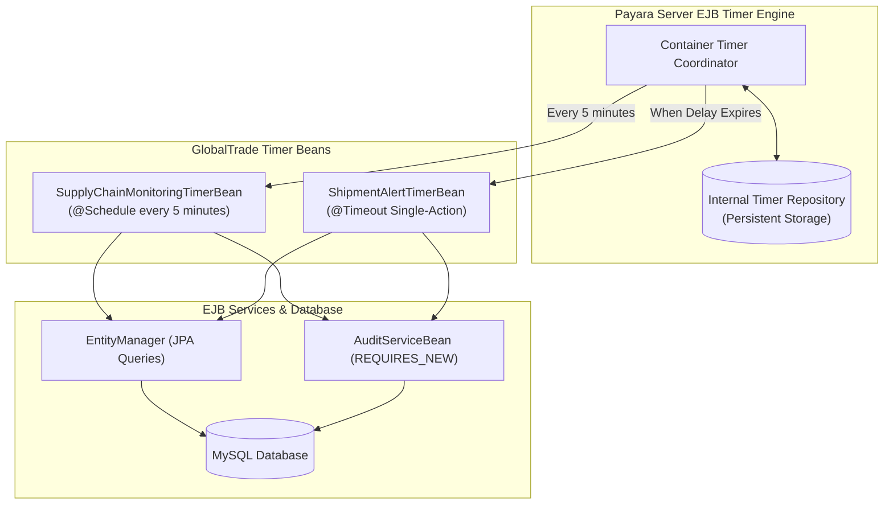

# GlobalTrade SCM — EJB Timer Services Guide

This document explains the enterprise scheduling and background automation architecture in GlobalTrade SCM, covering Declarative Automatic Timers (`@Schedule`), Programmatic Single-Action Timers (`TimerService`), and timer persistence.

---

## 1. What is an EJB Timer Service?

The **EJB Timer Service** is a built-in enterprise scheduling mechanism provided by Jakarta EE and Payara Server. It allows developers to register scheduled tasks that execute automatically in the background without needing external operating system cron jobs, background worker threads, or third-party schedulers.

### Why Use Container Timers Instead of `java.util.Timer` or `Thread.sleep`?
1. **Container Integration**: EJB timer callbacks automatically execute with transaction management (CMT), security context, and `@PersistenceContext` injection.
2. **Server Restart Persistence**: When configured with `persistent = true`, Payara stores timer metadata in its internal database. If the server is restarted or crashes, pending timers reload and fire automatically.
3. **Thread Pool Optimization**: Payara uses a managed thread pool to execute timers, preventing memory leaks and uncontrolled thread creation.



---

## 2. Declarative vs. Programmatic Timers

GlobalTrade SCM implements both timer models:

| Characteristic | Declarative Timer (`SupplyChainMonitoringTimerBean`) | Programmatic Timer (`ShipmentAlertTimerBean`) |
| :--- | :--- | :--- |
| **How it is created** | Static annotation `@Schedule(...)` placed directly on a method | Dynamically scheduled in code via `timerService.createSingleActionTimer(...)` |
| **Trigger condition** | Fixed calendar schedule (e.g. every 5 minutes) | Event-driven runtime delay (e.g. fire in 10,000 milliseconds) |
| **Lifecycle bean type** | `@Singleton @Startup` (one instance initialized at boot) | `@Stateless` (pooled bean receiving `@Timeout` callbacks) |
| **Cancellation** | Static configuration | Can be cancelled dynamically by searching `timerService.getTimers()` |
| **Primary use case** | Periodic system-wide inventory and shipment monitoring | Single-action tracking alerts for critical shipments and customs filings |

---

## 3. Declarative Monitoring Timer (`SupplyChainMonitoringTimerBean`)

- **Location**: `globaltrade-ejb/src/main/java/com/jiat/globaltrade/timer/SupplyChainMonitoringTimerBean.java`
- **Class Annotations**: `@Singleton`, `@Startup`, `@TransactionManagement(CONTAINER)`

### 3.1 Schedule Configuration
The timer callback method is configured with a persistent 5-minute cron-style expression:
```java
@Schedule(hour = "*", minute = "*/5", second = "0", persistent = true, info = "DeclarativeSupplyChainMonitoringTimer")
public void automaticMonitoringSchedule() {
    LOGGER.log(Level.INFO, "[SupplyChainMonitoringTimerBean] Automatic @Schedule timer triggered.");
    runMonitoringCycle("AUTOMATIC_SCHEDULED_TIMER");
}
```

### 3.2 What the Monitoring Cycle Checks
During each 5-minute cycle, `runMonitoringCycle` performs three critical supply-chain checks:

1. **Low Stock Detection**:
   ```sql
   SELECT i FROM InventoryItem i WHERE i.quantity <= i.reorderLevel
   ```
   Finds items where stock has fallen to or below the reorder threshold.
2. **Delayed Shipment Detection**:
   ```sql
   SELECT s FROM Shipment s WHERE s.shipmentStatus <> 'DELIVERED' AND s.expectedDeliveryDate < :today
   ```
   Finds non-delivered shipments that have missed their scheduled arrival date.
3. **Approaching Customs Filing Deadlines**:
   ```sql
   SELECT c FROM CustomsDocument c WHERE c.status IN ('PENDING', 'SUBMITTED') AND c.submissionDeadline <= :threshold
   ```
   Finds customs filings due within 48 hours.

### 3.3 Duplicate Alert Mitigation (Cooldown Cache)
To avoid spamming the audit logs with duplicate entries every 5 minutes for the same unchanged condition, the bean maintains an in-memory `alertCooldownCache`:
- Each alert key (`"LOW_STOCK:1"`, `"DELAYED_SHIPMENT:2"`) is cached with a 30-minute cooldown window.
- Duplicate alerts are suppressed until the 30-minute cooldown expires.

---

## 4. Programmatic Alert Timer (`ShipmentAlertTimerBean`)

- **Location**: `globaltrade-ejb/src/main/java/com/jiat/globaltrade/timer/ShipmentAlertTimerBean.java`
- **Class Annotations**: `@Stateless`, `@TransactionManagement(CONTAINER)`

### 4.1 How Programmatic Timers are Created
The bean injects `@Resource TimerService timerService` and schedules single-action alerts at runtime:

```java
@Resource
private TimerService timerService;

public AlertTimerInfo scheduleShipmentAlert(Long shipmentId, long delayMillis, String reason) {
    Shipment shipment = em.find(Shipment.class, shipmentId);
    
    // Attach serializable metadata payload
    AlertTimerInfo timerInfo = new AlertTimerInfo("SHIPMENT_ALERT", shipmentId, shipment.getTrackingNumber(), reason, delayMillis);
    
    // persistent = true ensures the timer survives server restart
    TimerConfig timerConfig = new TimerConfig(timerInfo, true);
    Timer timer = timerService.createSingleActionTimer(delayMillis, timerConfig);
    
    auditService.logAction("PROGRAMMATIC_TIMER_SCHEDULED", "Shipment", shipmentId, "SYSTEM", ...);
    return timerInfo;
}
```

### 4.2 The `@Timeout` Callback
When the specified delay expires, Payara automatically wakes the bean and invokes the method annotated with `@Timeout`:

```java
@Timeout
@TransactionAttribute(TransactionAttributeType.REQUIRED)
public void onTimeout(Timer timer) {
    Serializable info = timer.getInfo();
    if (info instanceof AlertTimerInfo alertInfo) {
        if ("SHIPMENT_ALERT".equals(alertInfo.getAlertType())) {
            handleShipmentAlertTimeout(alertInfo);
        }
    }
}
```

- **Smart Inspection**: Inside `handleShipmentAlertTimeout`, the bean re-checks the shipment status. If the shipment was already marked `DELIVERED` during the delay period, the alert is automatically marked `RESOLVED` without alarming operators!

---

## 5. What Payara Server Manages During Timer Execution

1. **Persistence & Recovery**: When Payara boots up, its timer subsystem queries its internal database for active timers whose expiration time has passed or is upcoming, resuming them automatically.
2. **Transaction Demarcation**: Timer callbacks execute inside a Container-Managed Transaction (`REQUIRED`). Any database operations or audit logging occur with full ACID guarantees.
3. **Thread Management**: The container assigns a managed worker thread to execute the timer callback, releasing it back to the server pool once finished.
