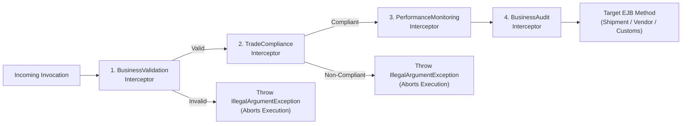
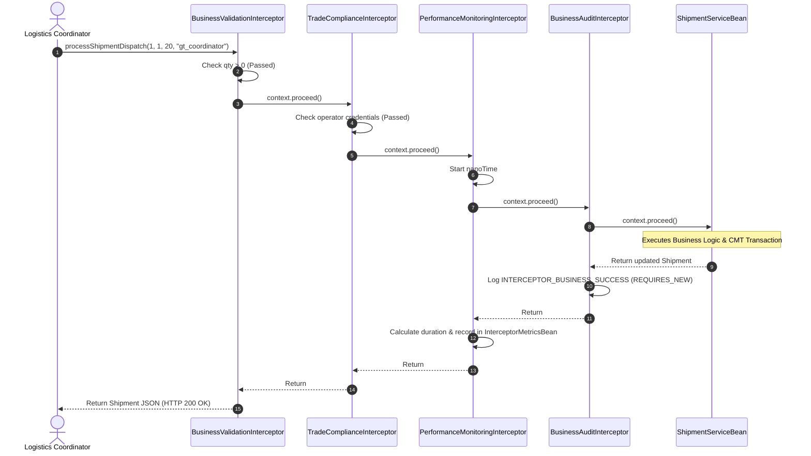
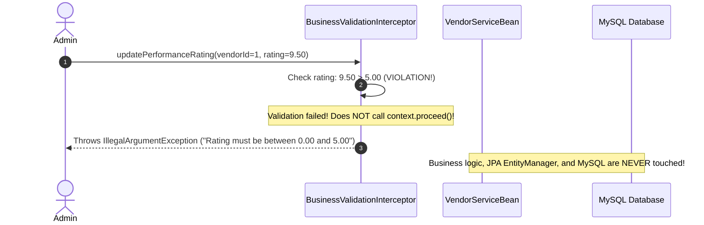
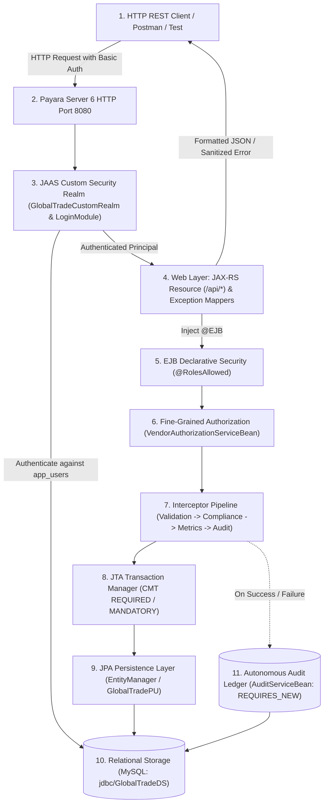

# GlobalTrade SCM — EJB Interceptors Guide

This document provides a comprehensive guide to the EJB Interceptor pipeline in GlobalTrade SCM. It explains cross-cutting concerns, interceptor chaining, parameter validation, trade compliance, performance profiling, audit interception, and exception propagation.

---

## 1. Interceptor Foundations (Beginner Overview)

### 1.1 What is an Interceptor?
An **interceptor** is a class that intercepts method calls to an EJB before and after the business logic executes. It allows developers to extract repetitive, non-business logic (such as input validation, latency metrics, compliance checks, and audit logging) into reusable classes.

```mermaid
graph TD
    subgraph WithoutInterceptors["Without Interceptors (Tightly Coupled)"]
        BadCaller["REST Resource"] --> BadEJB["EJB Business Method<br/>- Manual Validation Code<br/>- Manual Compliance Checks<br/>- Manual Timing Metrics<br/>- Manual Audit Logging<br/>- Actual Business Logic"]
    end

    subgraph WithInterceptors["With Interceptors (GlobalTrade SCM Pipeline)"]
        GoodCaller["REST Resource"] --> Int1["1. BusinessValidationInterceptor"]
        Int1 --> Int2["2. TradeComplianceInterceptor"]
        Int2 --> Int3 = ["3. PerformanceMonitoringInterceptor"]
        Int3 --> Int4["4. BusinessAuditInterceptor"]
        Int4 --> GoodEJB["EJB Business Method<br/>(Pure Domain Logic Only!)"]
    end
```

---

## 2. Core Interceptor Annotations & Concepts

| Element | Description |
| :--- | :--- |
| **`@AroundInvoke`** | Declares a method as an interceptor callback that wraps the target business method. |
| **`InvocationContext`** | A context object passed to the interceptor by Payara. It provides access to method metadata (`context.getMethod()`), target instance (`context.getTarget()`), and runtime parameters (`context.getParameters()`). |
| **`context.proceed()`** | Passes control to the next interceptor in the chain or to the target EJB method. If an interceptor does not call `context.proceed()`, execution stops immediately. |
| **`@Interceptors({...})`** | Declares the ordered list of interceptors to apply at the class or method level. |

---

## 3. The GlobalTrade Interceptor Pipeline

GlobalTrade SCM implements 4 interceptors located in `globaltrade-ejb/src/main/java/com/jiat/globaltrade/interceptor/`:



### 3.1 `BusinessValidationInterceptor`
- **Responsibility**: Fast-fail input parameter verification.
- **When it runs**: First in the chain.
- **Checks Performed**:
  - `updatePerformanceRating`: Verifies rating is not null and is within `[0.00, 5.00]`.
  - `increaseStock` / `decreaseStock`: Verifies quantity is $> 0$ and item ID is positive.
  - `processShipmentDispatch`: Verifies shipment ID, item ID, and dispatch quantity are positive numbers.
  - `createCustomsDocument`: Verifies document object is not null, document number is not empty, and type is specified.
- **Failure Behavior**: Throws `IllegalArgumentException` before `context.proceed()` is called, stopping execution before business logic is touched.

---

### 3.2 `TradeComplianceInterceptor`
- **Responsibility**: Enforces statutory cross-border regulatory rules.
- **When it runs**: Second in the chain (after basic input validation).
- **Checks Performed**:
  - `createCustomsDocument`: Verifies document reference number is at least 4 characters long and matches alphanumeric regulatory naming conventions (`^[A-Za-z0-9_\-]+$`).
  - `processShipmentDispatch`: Verifies that consignment dispatch requests include an authenticated operator credential.
- **Failure Behavior**: Throws `IllegalArgumentException` with a descriptive compliance failure message.

---

### 3.3 `PerformanceMonitoringInterceptor`
- **Responsibility**: High-precision method latency measurement.
- **When it runs**: Third in the chain, wrapping downstream interceptors and the EJB method.
- **Implementation**:
  ```java
  long startNanos = System.nanoTime();
  try {
      return context.proceed();
  } finally {
      long durationNanos = System.nanoTime() - startNanos;
      metricsBean.recordInvocation(methodSignature, durationNanos);
  }
  ```
- **Crucial Safeguard**: Uses a `try-finally` block so execution time is measured even if the business method fails. It **never swallows exceptions**, ensuring errors propagate cleanly to the caller.

---

### 3.4 `BusinessAuditInterceptor`
- **Responsibility**: Automated invocation audit logging.
- **When it runs**: Fourth in the chain (immediately before the EJB method).
- **Implementation**:
  ```java
  try {
      Object result = context.proceed();
      auditService.logAction("INTERCEPTOR_BUSINESS_SUCCESS", targetClass, targetId, "INTERCEPTOR", ...);
      return result;
  } catch (Exception e) {
      auditService.logAction("INTERCEPTOR_BUSINESS_FAILURE", targetClass, targetId, "INTERCEPTOR", ...);
      throw e; // Rethrows original exception unchanged!
  }
  ```
- **Crucial Safeguard**: Logs the failure in an autonomous transaction (`REQUIRES_NEW`) via `AuditServiceBean`, and then **rethrows the exact original exception** so container transaction rollbacks and HTTP exception mappers function properly.

---

## 4. Sequence Diagrams

### Diagram 1: Successful Execution Through Full Interceptor Pipeline


---

### Diagram 2: Fast-Fail Interception (Invalid Rating Rejected)


---

## 5. How Everything Connects (End-to-End Enterprise Chain)

The diagram below illustrates how all technologies and architectural tiers documented in Batch A and Batch B connect into a single unified request pipeline:


