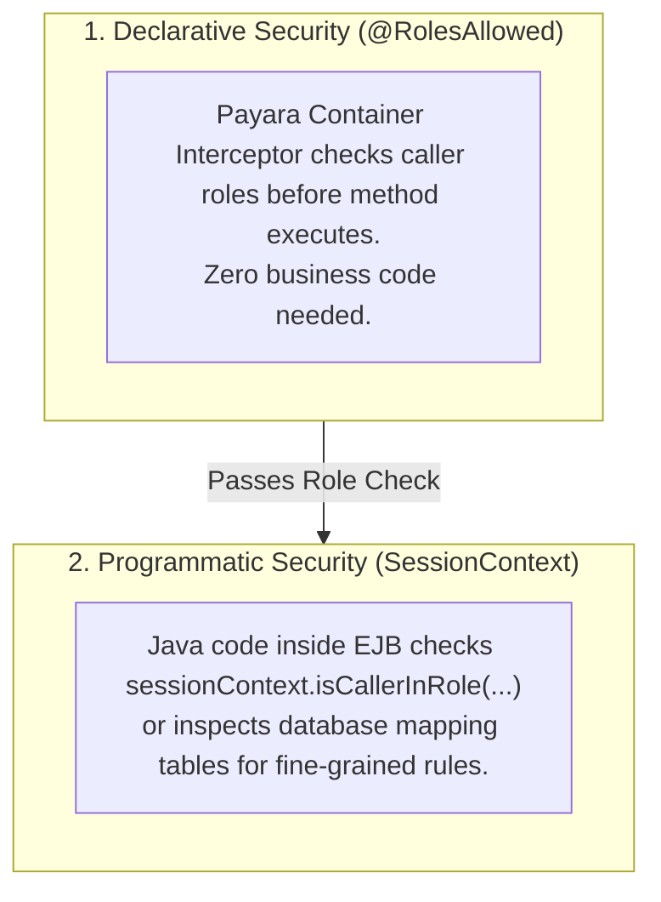
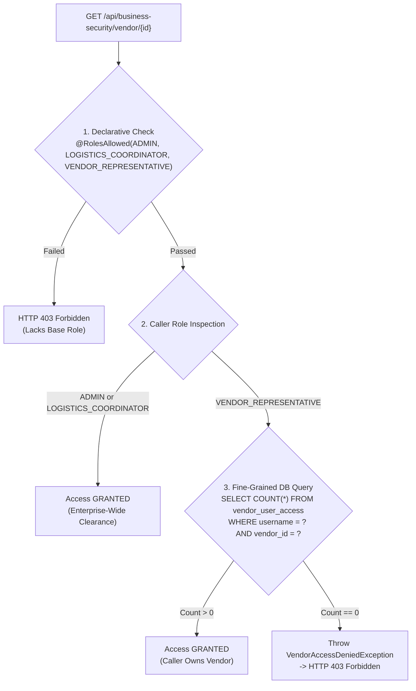
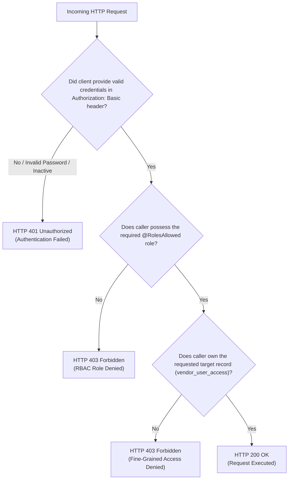

# GlobalTrade SCM — RBAC & Fine-Grained Authorization Guide

This document explains the authorization architecture of GlobalTrade SCM, covering Declarative Role-Based Access Control (RBAC), Programmatic Security (`SessionContext`), and multi-tenant fine-grained data isolation.

---

## 1. Authorization Foundations (Beginner Overview)

### 1.1 What is Authorization?
**Authorization** is the process of determining whether an already-authenticated user has permission to perform a specific action on a specific resource.

### 1.2 The Principle of Least Privilege
Enterprise systems enforce the **Principle of Least Privilege**: every user and system role is granted only the minimum permissions necessary to complete their job, preventing unauthorized data modification and data leaks.

---

## 2. Standard Enterprise Roles in GlobalTrade SCM

The project defines 7 system roles in `globaltrade-ejb/src/main/java/com/jiat/globaltrade/security/SecurityRoles.java`:

| Role Name | Constant | Permitted Operations in GlobalTrade SCM |
| :--- | :--- | :--- |
| **`ADMIN`** | `SecurityRoles.ADMIN` | Unrestricted administrative access across all endpoints, vendor rating updates, system health diagnostics, and emergency overrides. |
| **`LOGISTICS_COORDINATOR`** | `SecurityRoles.LOGISTICS_COORDINATOR` | Creates and updates shipments, initiates freight dispatches, and accesses operational data across all vendors. |
| **`CUSTOMS_AGENT`** | `SecurityRoles.CUSTOMS_AGENT` | Reviews customs declarations, approves or rejects cross-border trade documents, and verifies regulatory clearance. |
| **`WAREHOUSE_MANAGER`** | `SecurityRoles.WAREHOUSE_MANAGER` | Replenishes warehouse inventory stock, adjusts quantities, and processes physically verified dispatches. |
| **`VENDOR_REPRESENTATIVE`** | `SecurityRoles.VENDOR_REPRESENTATIVE` | External supplier representative. Strictly restricted to viewing and managing only their own company's assigned vendor profile. |
| **`CUSTOMER`** | `SecurityRoles.CUSTOMER` | Read-only consignment tracking and delivery status lookups. |
| **`SYSTEM`** | `SecurityRoles.SYSTEM` | Internal automated identity for `@Schedule` timers, metrics gathering, and autonomous audit logs. |

---

## 3. Declarative vs. Programmatic Security

GlobalTrade SCM combines both security models:



### 3.1 Declarative Security (Annotations)
- **`@RolesAllowed({ADMIN, CUSTOMS_AGENT})`**: The method can only be invoked if the caller has at least one of the listed roles. If not, Payara immediately throws `EJBAccessException` without executing the method.
- **`@PermitAll`**: The method is open to all callers (e.g. read-only lookups).
- **`@DenyAll`**: The method cannot be invoked by anyone (used for internal disabled methods).

### 3.2 Programmatic Security (`SessionContext`)
Used when business logic depends on the caller's specific identity or role:
```java
@Resource
private SessionContext sessionContext;

public boolean checkAccess() {
    Principal principal = sessionContext.getCallerPrincipal();
    String username = principal.getName();
    
    if (sessionContext.isCallerInRole(SecurityRoles.ADMIN)) {
        return true; // Admin granted global override
    }
    // Perform dynamic checks...
}
```

---

## 4. Fine-Grained Vendor Data Isolation

### 4.1 The Business Problem: Why `@RolesAllowed` is Not Enough
Imagine two external companies:
- Supplier A: *Apex Global* (Vendor ID: `1`) represented by user `gt_vendor`.
- Supplier B: *Pacific Trade* (Vendor ID: `2`).

If the EJB method `getVendor(id)` only had `@RolesAllowed(VENDOR_REPRESENTATIVE)`, user `gt_vendor` could send `GET /api/business-security/vendor/2` and read competitor Pacific Trade's pricing and contacts!

### 4.2 The Solution: Multi-Layered Authorization (`VendorAuthorizationServiceBean`)



### 4.3 Why Client-Supplied Roles or Identities are NEVER Trusted
In GlobalTrade SCM, the user ID and roles are **never taken from URL query parameters, HTTP headers, or request JSON bodies**. 

Instead, the identity is extracted directly from the authenticated server session via `sessionContext.getCallerPrincipal().getName()`. This guarantees that malicious clients cannot spoof other vendor accounts.

---

## 5. Decision Tree: HTTP 401 Unauthorized vs. HTTP 403 Forbidden



| HTTP Status | Meaning | Cause in GlobalTrade SCM |
| :--- | :--- | :--- |
| **`401 Unauthorized`** | Authentication Missing or Failed | Missing `Authorization` header, incorrect password, or account deactivated (`active = false`). |
| **`403 Forbidden`** | Authorization Denied | Caller authenticated successfully (e.g. `gt_warehouse`), but attempted an operation requiring `ADMIN`, or `gt_vendor` attempted to access Vendor #2. |

---

## 6. Common Viva Questions & Model Answers

### Q1: What is the difference between declarative and programmatic security?
> **Answer**: Declarative security uses annotations like `@RolesAllowed` where Payara enforces permissions automatically before the method runs. Programmatic security uses `SessionContext` (`getCallerPrincipal()`, `isCallerInRole()`) inside the method body for dynamic logic like querying `vendor_user_access` to enforce fine-grained data ownership.

### Q2: Why is `@RolesAllowed` alone insufficient for securing vendor data?
> **Answer**: `@RolesAllowed(VENDOR_REPRESENTATIVE)` only verifies that the caller is *a* vendor representative; it cannot know *which* vendor company the caller belongs to. Programmatic authorization is required to verify the database mapping between the caller's username and the requested `vendor_id`.

### Q3: How do we distinguish between HTTP 401 and HTTP 403?
> **Answer**: HTTP 401 means *unauthenticated* (the system does not know who you are because credentials are missing or invalid). HTTP 403 means *unauthorized/forbidden* (the system knows who you are, but your role or data-access permissions do not allow you to perform that action).
