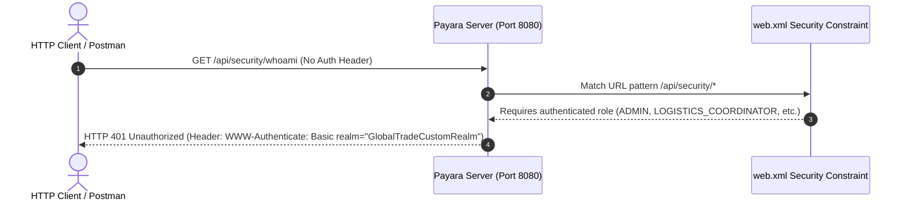
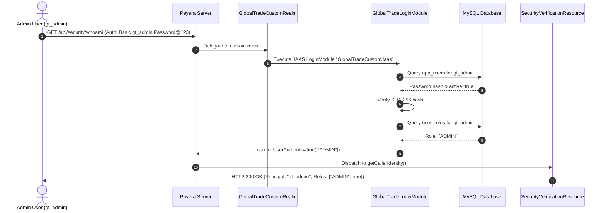
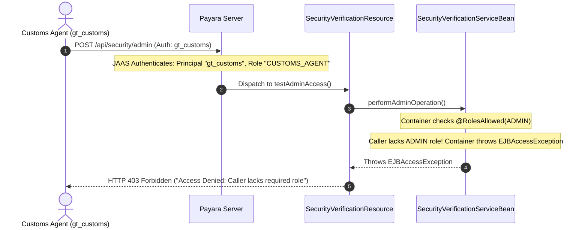
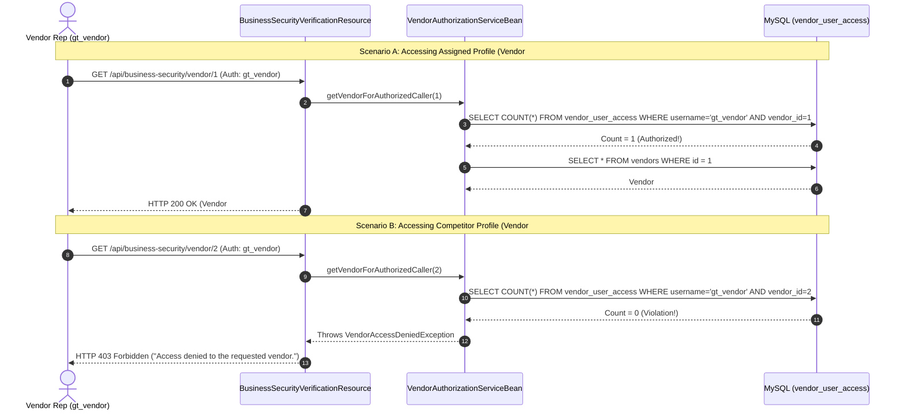
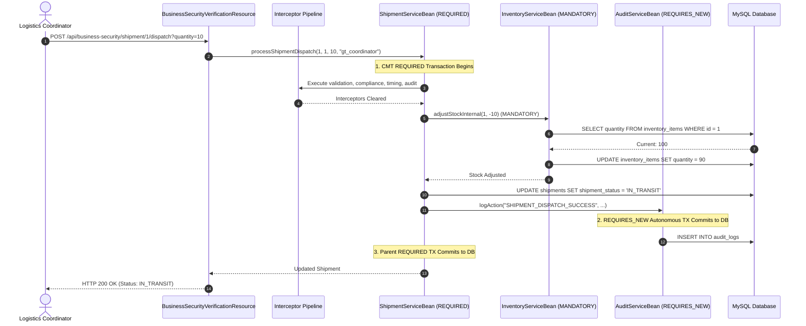
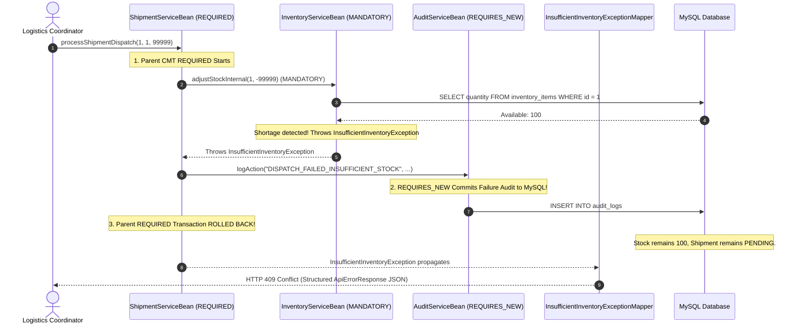
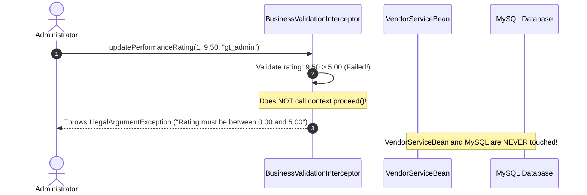
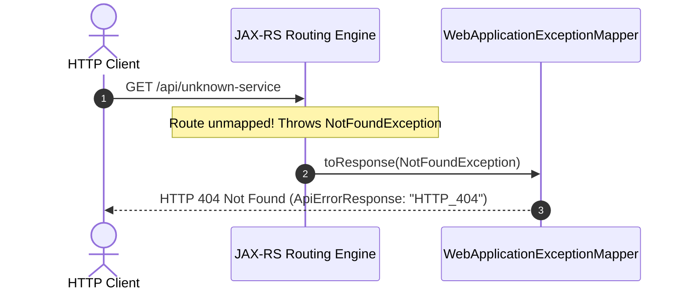
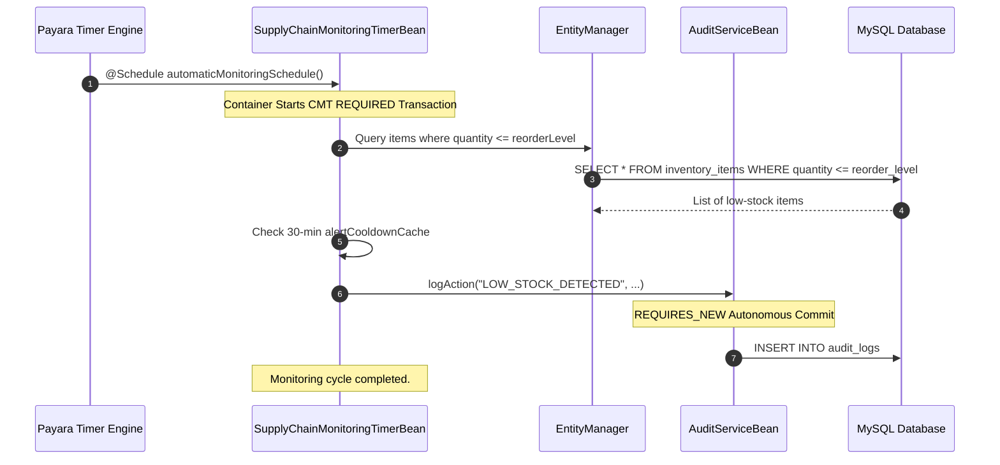
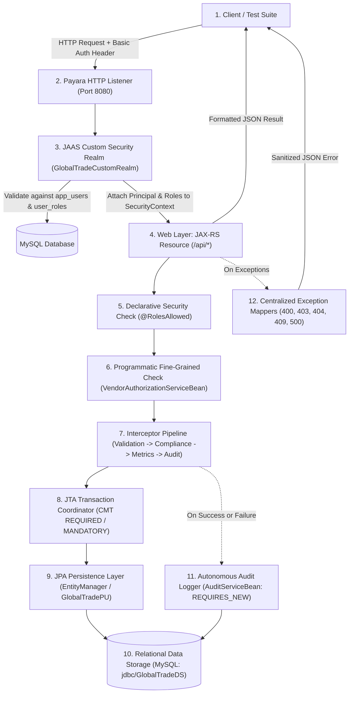

# GlobalTrade SCM — Request & Business Flows Guide

This document traces the complete end-to-end execution paths of all major request scenarios in GlobalTrade SCM, illustrating how security, interceptors, transactions, JPA persistence, and exception handling coordinate across the multi-tier architecture.

---

## 1. End-to-End Runtime Flows

### Flow 1: Unauthenticated Secured Request (HTTP 401)
- **Scenario**: A client attempts to call a protected endpoint without providing the `Authorization` header.

---

### Flow 2: Successful Administrator Authentication (HTTP 200)
- **Scenario**: An administrator authenticates with `gt_admin` and requests identity summary.

---

### Flow 3: RBAC Role Authorization Rejection (HTTP 403)
- **Scenario**: A Customs Clearance Officer (`gt_customs`) attempts to execute an admin-only diagnostic operation.

---

### Flow 4: Fine-Grained Vendor Authorization (Allowed vs. Denied)
- **Scenario A (Allowed)**: `gt_vendor` requests assigned Vendor #1.
- **Scenario B (Denied)**: `gt_vendor` attempts to access competitor Vendor #2.

---

### Flow 5: Multi-Step Shipment Dispatch Success
- **Scenario**: Logistics Coordinator dispatches a shipment with sufficient stock.

---

### Flow 6: Shipment Dispatch Rollback on Insufficient Stock
- **Scenario**: Dispatch requested with quantity exceeding available stock.

---

### Flow 7: Fast-Fail Interceptor Validation (Rating > 5.00)
- **Scenario**: An operator submits a vendor rating of `9.50` (outside valid `0.00 - 5.00` range).

---

### Flow 8: Unknown REST Endpoint Route (Preserved HTTP 404)
- **Scenario**: A client requests an unmapped URL path.

---

### Flow 9: Background Automated Timer Cycle
- **Scenario**: Payara Timer Engine triggers the 5-minute supply chain health check.

---

## 2. One Complete Mental Model (The Unified Enterprise Chain)

Every production request in GlobalTrade SCM travels through this unified architectural pipeline:

