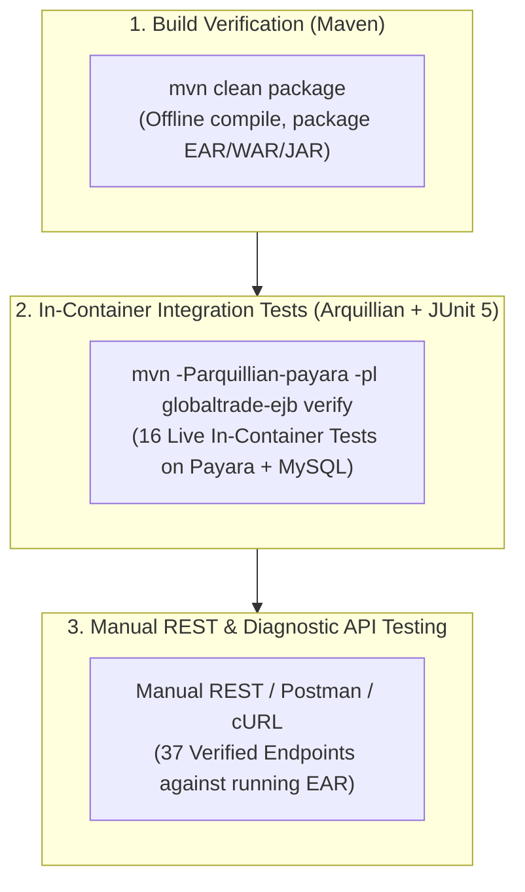
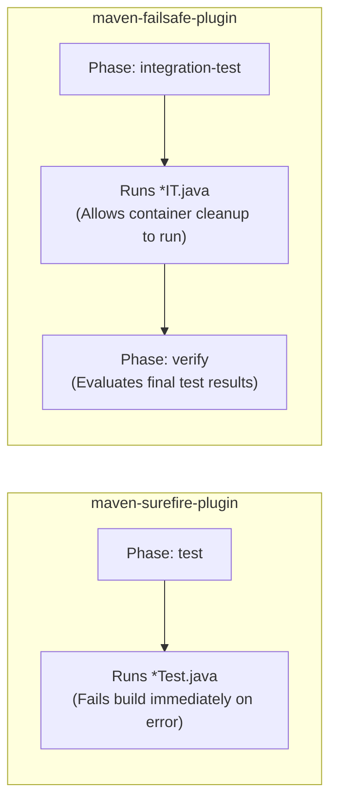

# GlobalTrade SCM — Testing Strategy Guide

This document explains the testing philosophy, testing levels, and automated verification strategy implemented in GlobalTrade SCM.

---

## 1. Testing Foundations (Beginner Concepts)

### 1.1 What is Software Testing?
**Software testing** is the process of evaluating an application to verify that it functions as expected, satisfies business requirements, and safely handles edge cases and error conditions.

### 1.2 Why Enterprise Applications Need Layered Testing
In a traditional monolithic or desktop application, a few simple unit tests might suffice. However, in an **enterprise multi-tier Jakarta EE application**, business logic does not execute in isolation. It relies heavily on container-provided services:
- **JTA Transactions**: Does the container automatically roll back stock adjustments when an exception is thrown?
- **JAAS Security Realms**: Does the application server correctly challenge unauthenticated HTTP requests and enforce `@RolesAllowed`?
- **JPA Object-Relational Mapping**: Do entities map accurately to relational MySQL tables through EclipseLink?
- **EJB Interceptors**: Does the `@AroundInvoke` chain execute in the exact order required?

A unit test with fake mock objects (e.g. Mockito) cannot prove whether Payara Server and MySQL will actually coordinate a rollback or enforce security. Therefore, enterprise systems require a **multi-layered testing strategy**.

---

## 2. Testing Levels in GlobalTrade SCM



The table below outlines the testing levels used throughout this project:

| Testing Level | Primary Tool | Target Environment | What It Proves |
| :--- | :--- | :--- | :--- |
| **1. Build Verification** | Maven Reactor | Offline (No server needed) | Validates Java syntax, module dependencies, POM configurations, and successful packaging of `.ear`, `.war`, and `.jar` artifacts. |
| **2. In-Container Integration** | Arquillian + JUnit 5 | Live Payara 6 + MySQL | Deploys micro-test WARs to a running Payara server to verify real EJB injection, JPA persistence, JTA transaction rollbacks, and interceptor chains. |
| **3. Security & RBAC Integration** | Arquillian (`@RunAsClient`) | Live Payara 6 + MySQL | Executes real HTTP Basic requests against `SecurityTestProbeServlet` to verify JAAS authentication, role enforcement, and fine-grained vendor data isolation. |
| **4. Manual REST API Verification** | Postman / cURL / Browser | Deployed `globaltrade.ear` | Tests all 37 production and diagnostic REST endpoints under various user roles. |
| **5. Full Regression Testing** | Maven Reactor + Arquillian | Clean environment | Ensures new features or bug fixes do not break existing persistence, security, or transaction rules. |

> [!NOTE]
> **Why No Pure Unit Tests?**
> The automated test suite in GlobalTrade SCM is **integration-focused**. In Jakarta EE, testing business EJBs with mocked container dependencies gives a false sense of security. Real bugs occur at transaction boundaries, SQL mapping mismatches, and JAAS realm configurations. In-container integration tests prove the real behavior of the running system.

---

## 3. Build Verification vs. Integration Test Execution

### 3.1 Normal Reactor Build (`mvn clean package`)
```bash
mvn clean package
```
- **Purpose**: Compiles all Java modules and packages `globaltrade.ear`.
- **Server Requirement**: **None**. Runs completely offline.
- **Execution Time**: Fast (typically 3–5 seconds).

### 3.2 Live Arquillian Integration Suite (`mvn -Parquillian-payara ...`)
```bash
mvn -Parquillian-payara -pl globaltrade-ejb verify
```
- **Purpose**: Activates the `arquillian-payara` profile, engages the `maven-failsafe-plugin`, connects to Payara Server over port 4848/8080, deploys test archives, executes in-container tests, and verifies assertions.
- **Server Requirement**: **Payara Server 6 and MySQL must be actively running**.
- **Execution Time**: In-depth (typically 15–30 seconds).

---

## 4. Surefire vs. Failsafe: Why `*IT.java` Naming Matters

Maven uses two distinct plugins for automated testing:



- **`maven-surefire-plugin`** runs during the standard `test` phase. If any test fails, it terminates the build immediately.
- **`maven-failsafe-plugin`** runs during the `integration-test` phase. If a test fails, it does *not* stop immediately; it allows post-integration cleanup and undeployment to complete before failing during the `verify` phase.
- All Arquillian integration tests follow the naming convention **`*IT.java`** so they are exclusively bound to Failsafe under the `arquillian-payara` profile.

---

## 5. The Verified Integration Test Inventory (16 Tests)

Direct audit of the test source code confirms **exactly 16 integration test methods** across 5 test classes:

| Test Class | Category | Tests | What It Proves |
| :--- | :--- | :---: | :--- |
| **`ArquillianContainerSmokeIT.java`** | Container Smoke | **1** | Proves remote Payara connection, ShrinkWrap deployment, and `@EJB` dependency injection. |
| **`PersistenceIntegrationIT.java`** | JPA Persistence | **3** | Proves `GlobalTradePU` persistence unit, `SELECT 1` connectivity, and vendor entity retrieval. |
| **`TransactionRollbackIntegrationIT.java`** | Transactions | **1** | Proves CMT `REQUIRED` rollback on shortage while `REQUIRES_NEW` audit log commits independently. |
| **`BusinessValidationInterceptorIT.java`** | Interceptors | **1** | Proves `@AroundInvoke` interceptor fast-fails invalid rating ($9.99 > 5.00$) without touching entity. |
| **`SecurityAuthenticationIT.java`** | Security & RBAC | **10** | Proves HTTP Basic auth, JAAS Realm, SHA-256 hash verification, active user flag, RBAC roles, and vendor isolation. |
| **TOTAL VERIFIED TESTS** | | **16** | **All 16 tests pass with 0 failures, 0 errors, and 0 skipped.** |

---

## 6. How I Would Explain the Testing Strategy in a Viva

> **Model Student Answer**:
> *"Our project uses an **in-container integration testing strategy** powered by JUnit 5 and Arquillian. Rather than writing artificial unit tests with mocked objects that cannot verify real enterprise behavior, we test our EJBs directly inside a live Payara 6 application server backed by MySQL.*
> 
> *Our test suite consists of **16 automated integration tests** split into two Maven workflows:*
> 1. *A normal build (`mvn clean package`) that runs offline to package our EAR.*
> 2. *An integration profile (`mvn -Parquillian-payara -pl globaltrade-ejb verify`) that deploys micro-archives using ShrinkWrap to verify real JPA persistence, CMT transaction rollbacks, EJB interceptors, and our custom JAAS security realm with HTTP Basic authentication.*
> 
> *All 16 tests execute and pass with 0 failures and 0 errors."*
