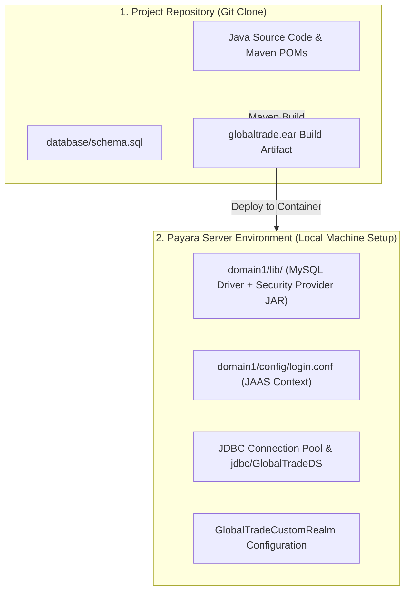
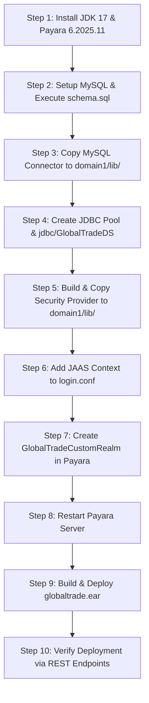

# GlobalTrade SCM — Payara Deployment & Configuration Guide

This document provides a practical, step-by-step guide to deploying and configuring the GlobalTrade SCM enterprise application on Payara Server 6.

---

## 1. Payara Server & Jakarta EE Concepts (Beginner Overview)

### 1.1 What is an Application Server?
An **application server** (such as Payara Server 6) is a specialized runtime container that hosts enterprise Java applications and provides built-in system-level services, including:
- **EJB Lifecycle & Pooling**: Automatically manages instances and thread concurrency.
- **JTA Transaction Coordinator**: Automatically manages multi-step database commit and rollback boundaries.
- **JAAS Security Subsystem**: Intercepts HTTP requests, verifies credentials, and manages user principals and role sets.
- **JNDI Directory Service**: Enables components to look up shared resources (like DataSources) using standard names (`jdbc/GlobalTradeDS`).
- **JPA Provider (EclipseLink)**: Translates Java entity operations into SQL queries and manages object caching.

---

## 2. Target Environment Specifications

The actual local development and testing environment for this project is configured as follows:

| Environment Property | Configured Value (Local Development) | Note |
| :--- | :--- | :--- |
| **Application Server** | **Payara Server Community 6.2025.11** | Jakarta EE 10 Full Platform Profile |
| **Java Development Kit** | **Java 17 LTS (Amazon Corretto / OpenJDK)** | Language level 17 |
| **HTTP Port** | **`8080`** | Standard HTTP web and REST listener |
| **Admin Console Port** | **`4848`** | Web administrative console (`http://localhost:4848`) |
| **Default Domain** | **`domain1`** | Default runtime domain |
| **Local Domain Path (Example)** | `C:/payara6/glassfish/domains/domain1/` | Windows filesystem path |
| **Database Engine** | **MySQL 8.0 / 8.4** | Port `3306`, database `globaltrade_db` |
| **Enterprise Packaging** | **`globaltrade-ear/target/globaltrade.ear`** | Enterprise Archive (EAR) containing EJB and WAR |

---

## 3. Project Files vs. Server Configuration

A common point of confusion for beginners is the difference between project files and server configuration:



> [!IMPORTANT]
> **Why `git clone` Alone is Not Enough**:
> Cloning the repository provides the Java source code and database scripts, but Payara Server must be configured with the JDBC DataSource, the MySQL driver, the custom security provider JAR in `domain1/lib`, and the JAAS realm before `globaltrade.ear` can run.

---

## 4. Fresh Machine Setup Order (Step-by-Step)

Follow these exact steps to configure a clean machine from scratch:



---

### Step 1: Install Prerequisites
- Install **JDK 17** and set `JAVA_HOME`.
- Download and extract **Payara Server 6.2025.11** to `C:/payara6` (or your preferred local directory).
- Start the server:
  ```powershell
  C:\payara6\bin\asadmin start-domain domain1
  ```

---

### Step 2: Initialize the MySQL Database
1. Create a MySQL database named `globaltrade_db`.
2. Execute the initialization script `database/schema.sql`. This creates all 10 relational tables and pre-seeds demo users (`gt_admin`, `gt_coordinator`, `gt_customs`, `gt_warehouse`, `gt_vendor`, `gt_customer`), roles, vendors, inventory items, and shipments.

---

### Step 3: Install MySQL JDBC Driver into Payara
Copy `mysql-connector-j-8.x.x.jar` into the Payara domain libraries directory:
- **Target Folder**: `C:/payara6/glassfish/domains/domain1/lib/`

---

### Step 4: Configure JDBC Connection Pool & DataSource
In the Payara Admin Console (`http://localhost:4848`) or via `asadmin`:

1. **Create JDBC Connection Pool (`GlobalTradePool`)**:
   - Resource Type: `javax.sql.DataSource`
   - Datasource Classname: `com.mysql.cj.jdbc.MysqlDataSource`
   - Additional Properties:
     - `ServerName`: `localhost`
     - `PortNumber`: `3306`
     - `DatabaseName`: `globaltrade_db`
     - `User`: `root` (or your DB username)
     - `Password`: `your_password`
     - `useSSL`: `false`
     - `allowPublicKeyRetrieval`: `true`
     - `serverTimezone`: `UTC`

2. **Create JDBC Resource (`jdbc/GlobalTradeDS`)**:
   - JNDI Name: `jdbc/GlobalTradeDS`
   - Pool Name: `GlobalTradePool`

---

### Step 5: Build & Install Custom Security Provider JAR
Build the standalone security provider module:
```bash
mvn clean package -pl globaltrade-security-provider
```
Copy the compiled JAR file:
- **Source**: `globaltrade-security-provider/target/globaltrade-security-provider.jar`
- **Destination**: `C:/payara6/glassfish/domains/domain1/lib/globaltrade-security-provider.jar`

---

### Step 6: Configure `login.conf` Entry
Open `C:/payara6/glassfish/domains/domain1/config/login.conf` in a text editor and append the following JAAS configuration block at the bottom:

```text
GlobalTradeCustomJaas {
    com.jiat.globaltrade.security.jaas.GlobalTradeLoginModule required;
};
```

---

### Step 7: Create Custom Security Realm in Payara
In the Payara Admin Console (`http://localhost:4848`):
1. Navigate to: **Configurations** $\rightarrow$ **server-config** $\rightarrow$ **Security** $\rightarrow$ **Realms**.
2. Click **New...** and configure the realm with these exact properties:

| Property Name | Required Configuration Value |
| :--- | :--- |
| **Name** | `GlobalTradeCustomRealm` |
| **Class Name** | `com.jiat.globaltrade.security.jaas.GlobalTradeCustomRealm` |
| **JAAS Context** | `GlobalTradeCustomJaas` |

**Additional Properties**:
- `datasource-jndi`: `jdbc/GlobalTradeDS`
- `user-table`: `app_users`
- `user-name-column`: `username`
- `password-column`: `password_hash`
- `group-table`: `user_roles`
- `group-name-column`: `role_name`
- `group-user-name-column`: `username`
- `digest-algorithm`: `SHA-256`
- `encoding`: `hex`
- `charset`: `UTF-8`

---

### Step 8: Restart Payara Server
Because libraries in `domain1/lib/` and security realms in `login.conf` are loaded only during server initialization, restart Payara Server:
```powershell
C:\payara6\bin\asadmin restart-domain domain1
```

---

### Step 9: Build & Deploy `globaltrade.ear`
1. Build the complete multi-module enterprise project:
   ```bash
   mvn clean package
   ```
2. Deploy `globaltrade-ear/target/globaltrade.ear` using the Admin Console (`Applications` $\rightarrow$ `Deploy...`), IntelliJ IDEA Application Server integration, or the CLI:
   ```powershell
   C:\payara6\bin\asadmin deploy --force=true globaltrade-ear/target/globaltrade.ear
   ```

---

### Step 10: Verify Deployment

#### 1. Public Health Check:
```bash
curl -X GET http://localhost:8080/globaltrade/api/health/database
```
*Expected Response (`HTTP 200 OK`)*:
```json
{
  "databaseConnected": true,
  "vendorCount": 3,
  "status": "UP"
}
```

#### 2. Authenticated RBAC Identity Check:
```bash
curl -X GET http://localhost:8080/globaltrade/api/security/whoami -u gt_admin:Password@123
```
*Expected Response (`HTTP 200 OK`)*:
```json
{
  "status": "SUCCESS",
  "authenticated": true,
  "principal": "gt_admin",
  "roles": {
    "ADMIN": true,
    "LOGISTICS_COORDINATOR": false,
    "CUSTOMS_AGENT": false,
    "WAREHOUSE_MANAGER": false,
    "VENDOR_REPRESENTATIVE": false,
    "CUSTOMER": false
  }
}
```

---

## 5. Common Viva Questions & Model Answers

### Q1: Why is `globaltrade.ear` deployed to Payara, but `globaltrade-security-provider.jar` is copied to `domain/lib`?
> **Answer**: `globaltrade.ear` contains the application business logic (EJBs, REST endpoints, entities) which has an application-level lifecycle. However, Payara's security subsystem loads security realms at the server-level during server boot before applications are deployed. Installing `globaltrade-security-provider.jar` in `domain/lib` makes the realm classes available to the server-level classloader.

### Q2: Why is a server restart required after adding files to `domain/lib` or editing `login.conf`?
> **Answer**: The server-level classloader and the JAAS configuration registry initialize when the JVM starts. Changes to `domain/lib` or `login.conf` are not detected dynamically by running application classloaders and require a server restart to take effect.
