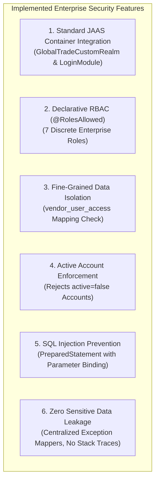
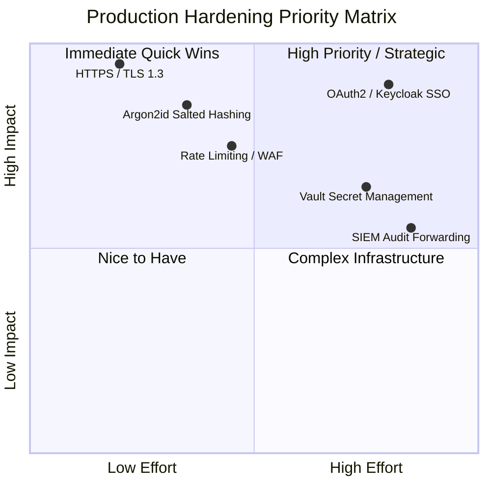

# GlobalTrade SCM — Security & Production Considerations Guide

This document evaluates the security architecture of GlobalTrade SCM, contrasting the current academic prototype implementation with the hardening standards required for enterprise production environments.

---

## 1. Prototype Implementation vs. Production Standards

| Dimension | Current Academic Prototype (Implemented) | Production Recommendation (Not Implemented) |
| :--- | :--- | :--- |
| **Transport Layer** | HTTP over Localhost (`http://localhost:8080`) | **HTTPS / TLS 1.3 with Strict-Transport-Security (HSTS)** |
| **Authentication Scheme** | HTTP Basic (`Authorization: Basic`) | **OAuth2 / OpenID Connect (OIDC) with Bearer JWT or Session Cookies** |
| **Password Hashing** | SHA-256 Hex Digest (Unsalted) | **Argon2id, bcrypt, or PBKDF2 with cryptographically random per-user salts** |
| **User Management** | Local MySQL database (`app_users`, `user_roles`) | **Centralized Enterprise IdP (Keycloak, Azure AD, Okta, LDAP)** |
| **Multi-Factor Auth (MFA)** | Single Factor (Username + Password) | **MFA via TOTP (Authenticator Apps) or FIDO2 / WebAuthn Hardware Keys** |
| **Brute-Force Defense** | Inactive user flag (`active = false`) | **Automated rate limiting, IP throttling, and account lockout policies** |
| **Secret Management** | Local Payara DataSource configuration | **External Secret Managers (HashiCorp Vault, AWS Secrets Manager)** |
| **Audit Log Storage** | Local MySQL relational table (`audit_logs`) | **Immutable Write-Once SIEM (Elasticsearch, Splunk) with Alerting** |

---

## 2. Strengths of the Current Implementation

The current implementation is designed to demonstrate core Jakarta EE security concepts cleanly:

1. **Standard JAAS Architecture**: Security is handled at the application server container level rather than through ad-hoc web filters.
2. **Multi-Layered RBAC**: Enforces both declarative `@RolesAllowed` checks and programmatic data-ownership rules (`vendor_user_access`).
3. **Parametrized Queries**: All SQL statements in `GlobalTradeLoginModule`, `GlobalTradeCustomRealm`, and JPA repositories use `PreparedStatement` binding, completely preventing SQL injection.
4. **Account State Enforcement**: The login module explicitly checks the `active` boolean column, preventing deactivated accounts from authenticating even if credentials match.
5. **Safe Error Masking**: `GenericExceptionMapper` and specialized mappers intercept unhandled exceptions and return uniform `ApiErrorResponse` JSON payloads with zero stack trace or internal server path leakage.

---

## 3. Prototype Limitations & Why They Exist

### 3.1 HTTP Basic Authentication over Plain HTTP
- **Current Behavior**: Transmits `username:password` encoded in Base64 across HTTP port 8080.
- **Why It Was Chosen**: Simplifies automated Arquillian testing and Postman manual testing in local development without requiring self-signed SSL certificate installation.
- **Production Vulnerability**: Base64 is not encryption; credentials can be sniffed over unencrypted networks.

### 3.2 Unsalted SHA-256 Hashing
- **Current Behavior**: Computes raw `SHA-256` hexadecimal hashes.
- **Why It Was Chosen**: Enables reproducible, readable test fixtures pre-seeded in `database/schema.sql`.
- **Production Vulnerability**: SHA-256 is designed for speed, making it susceptible to precomputed rainbow table attacks and high-speed GPU brute-force attacks.

---

## 4. Production Hardening Roadmap & Priority Matrix

### High Priority (Mandatory for Production):
1. **Enforce HTTPS / TLS 1.3**: Terminate TLS at the reverse proxy (Nginx / Cloudflare) or configure Payara HTTPS listener on port 8181 with valid CA certificates.
2. **Upgrade Password Hashing**: Migrate from raw SHA-256 to **Argon2id** or **bcrypt** with unique 16-byte random cryptographic salts and adaptive work factors.
3. **Externalize Database Secrets**: Remove database credentials from plain text XML/properties files; inject via container environment variables or HashiCorp Vault.

### Medium Priority (Enterprise Scalability):
4. **Centralized Identity Provider (IdP)**: Replace local database authentication with OpenID Connect (OIDC) / SAML 2.0 connected to Keycloak, Azure Active Directory, or Okta.
5. **Multi-Factor Authentication (MFA)**: Enforce TOTP or WebAuthn/FIDO2 hardware keys for high-privilege roles (`ADMIN`, `CUSTOMS_AGENT`).
6. **API Rate Limiting & Account Lockout**: Implement token-bucket rate limiting (e.g. 100 requests/minute per IP) and lock accounts after 5 consecutive failed login attempts.

### Low Priority (Operational Maturity):
7. **SIEM Audit Log Forwarding**: Stream audit records to Elasticsearch/Splunk to prevent local database tampering.
8. **Automated Vulnerability Scanning**: Integrate OWASP Dependency-Check and SonarQube into CI/CD pipelines.

---

## 5. Common Viva Questions & Model Answers

### Q1: Why is plain SHA-256 insufficient for storing passwords in production?
> **Answer**: SHA-256 is a general-purpose cryptographic hash designed for high throughput. Modern GPUs can calculate billions of SHA-256 hashes per second, making unsalted hashes vulnerable to rainbow tables and brute-force attacks. Production systems must use slow, memory-hard hashing algorithms like Argon2id or bcrypt with unique cryptographic salts.

### Q2: Why is HTTP Basic authentication only acceptable over HTTPS?
> **Answer**: HTTP Basic authentication transmits credentials encoded in Base64 in the `Authorization` header. Because Base64 is an encoding scheme, not encryption, any attacker on the local network or proxy can decode the string back to plain text. HTTPS provides transport-layer TLS encryption, ensuring the header cannot be intercepted in transit.

### Q3: Why is it important to mask exception stack traces in REST API responses?
> **Answer**: Exposing raw Java stack traces leaks sensitive internal details, such as framework versions, database table names, SQL syntax, and server file paths. Malicious attackers use this information to craft targeted exploits. Returning sanitized, structured error payloads prevents information leakage.
