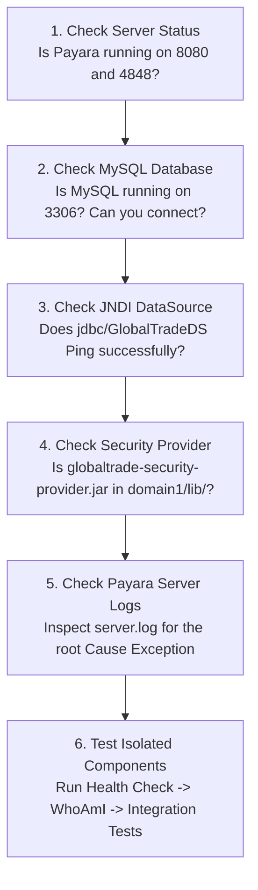

# GlobalTrade SCM — Troubleshooting & Diagnostics Guide

This document provides solutions for common runtime, deployment, security, database, and integration testing issues in GlobalTrade SCM.

---

## 1. "Do Not Panic: Debug in This Order" (Beginner Checklist)

When an error occurs, do not randomly change code or delete configurations. Follow this systematic 6-step checklist:



---

## 2. Safe Diagnostic Hierarchy for Security Failures

If you receive an unexpected `HTTP 401 Unauthorized` or `HTTP 403 Forbidden`, troubleshoot in this exact order:

```mermaid
flowchart LR
    A["1. Credentials<br/>(Username & Password)"] --> B["2. Active Flag<br/>(active == true in app_users)"]
    B --> C["3. Realm Config<br/>(GlobalTradeCustomRealm in Payara)"]
    C --> D["4. JAAS login.conf<br/>(GlobalTradeCustomJaas Entry)"]
    D --> E["5. DataSource<br/>(jdbc/GlobalTradeDS Connectivity)"]
    E --> F["6. Role Mapping<br/>(user_roles Table)"]
    F --> G["7. URL Constraints<br/>(web.xml Security Constraints)"]
    G --> H["8. EJB Security<br/>(@RolesAllowed Annotations)"]
    H --> I["9. Data Ownership<br/>(vendor_user_access Table)"]
```



---

## 3. Comprehensive Troubleshooting Catalog

---

### Issue 1: Payara Server Does Not Start
- **Symptom**: Running `asadmin start-domain domain1` hangs or outputs `Domain domain1 failed to start`.
- **Likely Cause**: Port conflict on 8080 or 4848, incompatible Java version, or corrupted `domain.xml`.
- **How to Check**:
  ```powershell
  Get-Process -Id (Get-NetTCPConnection -LocalPort 8080,4848 -ErrorAction SilentlyContinue).OwningProcess
  ```
- **How to Fix**: Kill the conflicting process or verify that `JAVA_HOME` points to JDK 17.

---

### Issue 2: Admin Console (Port 4848) Unavailable
- **Symptom**: Browser shows `Connection Refused` at `http://localhost:4848`.
- **Likely Cause**: Payara Server is still booting, terminated unexpectedly, or HTTPS is enforced.
- **How to Check**: Check Payara log: `C:/payara6/glassfish/domains/domain1/logs/server.log`.
- **How to Fix**: Wait 15 seconds for startup to complete; try `https://localhost:4848` if secure admin is enabled.

---

### Issue 3: Port 8080 or 4848 Already in Use
- **Symptom**: `Address already in use: bind` error during Payara boot.
- **Likely Cause**: A previous Payara, Tomcat, or Docker instance is occupying the port.
- **How to Check**:
  ```powershell
  netstat -ano | findstr :8080
  ```
- **How to Fix**: Terminate the lingering Java process via Task Manager or PowerShell:
  ```powershell
  Stop-Process -Id <PID> -Force
  ```

---

### Issue 4: Application Deployment Fails
- **Symptom**: `asadmin deploy` fails with `Deployment Error: Exception while deploying the app`.
- **Likely Cause**: Missing DataSource, missing JAAS realm, or entity descriptor mismatch.
- **How to Check**: Inspect the tail of `server.log` for `SEVERE` or `DeploymentException`.
- **How to Fix**: Ensure `jdbc/GlobalTradeDS` and `GlobalTradeCustomRealm` are created before deploying `globaltrade.ear`.

---

### Issue 5: `/globaltrade/api/...` Returns HTTP 404 Not Found
- **Symptom**: Requesting endpoints returns `HTTP 404`.
- **Likely Cause**: Context root mismatch or EAR is not currently active.
- **How to Check**: Verify application state in Admin Console under **Applications** $\rightarrow$ `globaltrade` (Status: `Enabled`).
- **How to Fix**: Confirm URL starts with context root `/globaltrade` and JAX-RS prefix `/api` (e.g. `http://localhost:8080/globaltrade/api/health/database`).

---

### Issue 6: Database Health Endpoint Returns Failure / UP: False
- **Symptom**: `GET /api/health/database` returns `"databaseConnected": false`.
- **Likely Cause**: MySQL service stopped or database credentials invalid.
- **How to Check**: Test MySQL connection using CLI: `mysql -u root -p -e "USE globaltrade_db; SELECT 1;"`.
- **How to Fix**: Start MySQL Server service and verify credentials in Payara Connection Pool `GlobalTradePool`.

---

### Issue 7: `jdbc/GlobalTradeDS` JNDI Lookup Fails
- **Symptom**: `NamingException: Lookup failed for 'java:app/jdbc/GlobalTradeDS'` or `jdbc/GlobalTradeDS not found`.
- **Likely Cause**: The JDBC Resource name in Payara does not match the JNDI name specified in `persistence.xml`.
- **How to Check**: Run `asadmin list-jdbc-resources` and verify `jdbc/GlobalTradeDS` is listed.
- **How to Fix**: Recreate the resource in Payara Admin Console pointing to `GlobalTradePool`.

---

### Issue 8: MySQL Driver Missing
- **Symptom**: `ClassNotFoundException: com.mysql.cj.jdbc.MysqlDataSource` or Connection Pool ping fails.
- **Likely Cause**: `mysql-connector-j-8.x.jar` is missing from Payara domain libraries.
- **How to Check**: Check if JAR exists in `C:/payara6/glassfish/domains/domain1/lib/`.
- **How to Fix**: Copy `mysql-connector-j-8.x.jar` into `domain1/lib/` and restart Payara.

---

### Issue 9: `GlobalTradeCustomRealm` Class Not Found
- **Symptom**: Server startup logs show `ClassNotFoundException: com.jiat.globaltrade.security.jaas.GlobalTradeCustomRealm`.
- **Likely Cause**: `globaltrade-security-provider.jar` was not placed in `domain1/lib/`.
- **How to Check**:
  ```powershell
  Test-Path "C:\payara6\glassfish\domains\domain1\lib\globaltrade-security-provider.jar"
  ```
- **How to Fix**: Build provider with `mvn clean package -pl globaltrade-security-provider`, copy to `domain1/lib/`, and restart Payara.

---

### Issue 10: `GlobalTradeCustomJaas` Not Found in `login.conf`
- **Symptom**: Login attempts produce `LoginException: No LoginModules configured for GlobalTradeCustomJaas`.
- **Likely Cause**: The JAAS context block is missing from `domain1/config/login.conf`.
- **How to Check**: Open `domain1/config/login.conf` and verify the `GlobalTradeCustomJaas` block exists.
- **How to Fix**: Append the block to `login.conf` and restart Payara Server:
  ```text
  GlobalTradeCustomJaas {
      com.jiat.globaltrade.security.jaas.GlobalTradeLoginModule required;
  };
  ```

---

### Issue 11: Correct Password Returns HTTP 401 Unauthorized
- **Symptom**: Entering `gt_admin` and `Password@123` fails with `HTTP 401`.
- **Likely Cause**: The account is deactivated (`active = 0` in database) or hash encoding mismatch.
- **How to Check**:
  ```sql
  SELECT username, password_hash, active FROM app_users WHERE username = 'gt_admin';
  ```
- **How to Fix**: Ensure `active = 1` (true). Verify password hash matches SHA-256 lowercase hex of `Password@123`:
  `5e884898da28047151d0e56f8dc6292773603d0d6aabbdd62a11ef721d1542d8`.

---

### Issue 12: Authenticated User Receives HTTP 403 Forbidden
- **Symptom**: User authenticates successfully, but gets `HTTP 403` on a business endpoint.
- **Likely Cause**: The user lacks the required role in `user_roles` table or `@RolesAllowed` rejected the caller.
- **How to Check**: Query `SELECT role_name FROM user_roles WHERE username = 'target_user';`.
- **How to Fix**: Assign the required role (e.g. `ADMIN` or `LOGISTICS_COORDINATOR`) to the user.

---

### Issue 13: Vendor 1 Works but Vendor 2 Fails with HTTP 403
- **Symptom**: User `gt_vendor` can view Vendor #1, but receives `403 Forbidden` on Vendor #2.
- **Explanation**: **This is expected, correct behavior!** GlobalTrade SCM enforces fine-grained data isolation. User `gt_vendor` is mapped exclusively to Vendor #1 in `vendor_user_access`. Only `ADMIN` or `LOGISTICS_COORDINATOR` can access all vendors.

---

### Issue 14: Unknown Route Incorrectly Returns HTTP 500
- **Symptom**: Requesting an invalid URL returns `500 Internal Server Error` instead of `404 Not Found`.
- **Likely Cause**: Exception mapper improperly catching `NotFoundException` as a generic `Throwable`.
- **How to Check**: Verify that `WebApplicationExceptionMapper.java` is registered in `globaltrade-web`.
- **How to Fix**: Ensure `WebApplicationExceptionMapper` preserves the original HTTP status code.

---

### Issue 15: Arquillian Cannot Connect to Payara Server
- **Symptom**: Running integration tests fails with `Cannot connect to Payara REST admin interface`.
- **Likely Cause**: Payara Server is not running, or admin port in `arquillian.xml` is misconfigured.
- **How to Check**: Verify `arquillian.xml` specifies `adminPort` `4848` and `httpPort` `8080`.
- **How to Fix**: Start Payara Server before running `mvn -Parquillian-payara -pl globaltrade-ejb verify`.

---

### Issue 16: Arquillian Test Deployment Fails
- **Symptom**: Arquillian outputs `ArchiveDeploymentException: Cannot deploy test archive`.
- **Likely Cause**: Missing dependency class or malformed `beans.xml` in ShrinkWrap archive.
- **How to Check**: Inspect `TestDeployments.java` to verify all required entity, service, and security packages are added.

---

### Issue 17: Normal Build Works, but Integration Tests Fail
- **Symptom**: `mvn clean package` succeeds, but `mvn -Parquillian-payara ... verify` fails.
- **Likely Cause**: Integration tests require live Payara Server and MySQL database, whereas normal build is offline.
- **How to Fix**: Start MySQL and Payara Server with pre-seeded database before running integration tests.

---

### Issue 18: Integration Test Count is Reported as 0
- **Symptom**: Maven finishes with `Tests run: 0`.
- **Likely Cause**: Profile `-Parquillian-payara` was omitted, or tests do not end in `*IT.java`.
- **How to Fix**: Run with full command: `mvn -Parquillian-payara -pl globaltrade-ejb verify`.

---

### Issue 19: Maven Cannot Resolve Payara Internal JAR Paths
- **Symptom**: `globaltrade-security-provider` build fails with missing `glassfish-ee-api.jar`.
- **Likely Cause**: `${payara.home}` property in root `pom.xml` points to an incorrect directory.
- **How to Fix**: Pass `-Dpayara.home="C:/payara6"` during build or update the property in `pom.xml`.

---

### Issue 20: Timer Service Does Not Appear to Run
- **Symptom**: Automatic monitoring audit logs are not appearing every 5 minutes.
- **Likely Cause**: Payara Timer service disabled or previous timer job suspended.
- **How to Check**: Use the diagnostic endpoint `POST /api/timers/run-monitoring` to trigger the cycle manually.

---

### Issue 21: Transaction Rollback Test Fails
- **Symptom**: `TransactionRollbackIntegrationIT` fails indicating stock quantity mutated.
- **Likely Cause**: `InsufficientInventoryException` missing `@ApplicationException(rollback = true)`.
- **How to Fix**: Verify `InsufficientInventoryException.java` contains `@ApplicationException(rollback = true)`.
