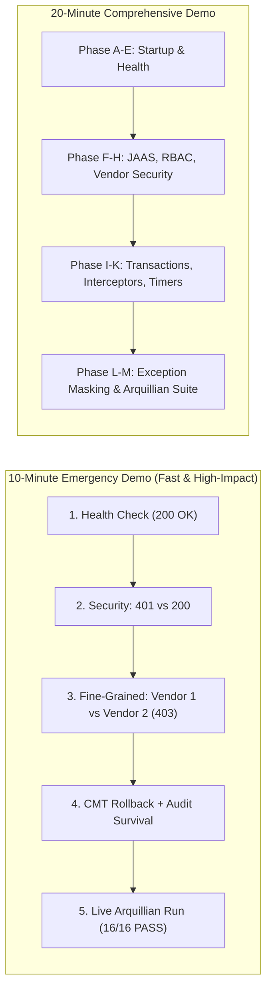

# GlobalTrade SCM — Live Viva Demonstration Runbook

This document provides a step-by-step checklist and runbook for demonstrating the GlobalTrade SCM enterprise application during a live viva examination.

---

## 1. Demo Timelines at a Glance



---

## 2. Pre-Viva Safety Rules & Warnings

> [!CAUTION]
> **Five Golden Rules for a Smooth Demo**:
> 1. **Do not modify Payara configurations** or delete domain libraries during the viva.
> 2. **Do not delete seed database rows** in MySQL; test cases depend on pre-seeded records (`Vendor #1`, `Item #1`, `Shipment #1`).
> 3. **Do not deactivate demo accounts** (`active = false`) unless specifically demonstrating the inactive-user check, and restore them immediately.
> 4. **Do not run ad-hoc cleanup SQL** that drops foreign key tables.
> 5. **Pre-start MySQL and Payara Server 10 minutes before the exam begins**.

---

## 3. Step-by-Step Viva Demonstration Script

---

### Phase A: Pre-Flight Environment Checks
Before the examiner joins, verify:
- [ ] MySQL is running on port `3306`.
- [ ] Payara Server 6 is running (`asadmin start-domain domain1`).
- [ ] Terminal / PowerShell window is open at project root.
- [ ] Postman (or browser / cURL terminal) is open and ready.

---

### Phase B: Basic Health & JPA Connectivity Check
- **Action**: Execute public health check.
- **Request**:
  ```bash
  curl -X GET http://localhost:8080/globaltrade/api/health/database
  ```
- **Expected Result (`HTTP 200 OK`)**:
  ```json
  {
    "databaseConnected": true,
    "vendorCount": 3,
    "status": "UP"
  }
  ```
- **What to Explain to Examiner**: *"This proves that Payara Server is connected to MySQL via JNDI DataSource `jdbc/GlobalTradeDS` and EclipseLink JPA EntityManager is actively querying the database."*

---

### Phase C: Authentication Demo (HTTP Basic + JAAS Realm)

#### 1. Unauthenticated Request:
- **Request**:
  ```bash
  curl -i -X GET http://localhost:8080/globaltrade/api/security/whoami
  ```
- **Expected Result**: **`HTTP 401 Unauthorized`** with `WWW-Authenticate: Basic realm="GlobalTradeCustomRealm"`.
- **What to Explain**: *"Payara intercepts the request and challenges unauthenticated access under our custom realm."*

#### 2. Valid Admin Authentication:
- **Request**:
  ```bash
  curl -X GET http://localhost:8080/globaltrade/api/security/whoami -u gt_admin:Password@123
  ```
- **Expected Result (`HTTP 200 OK`)**:
  ```json
  {
    "status": "SUCCESS",
    "authenticated": true,
    "principal": "gt_admin",
    "roles": { "ADMIN": true, "LOGISTICS_COORDINATOR": false, ... }
  }
  ```
- **What to Explain**: *"Our custom `GlobalTradeLoginModule` verified the password hash against `app_users` and populated the security context with the `ADMIN` role."*

---

### Phase D: RBAC & Fine-Grained Vendor Isolation Demo

#### 1. RBAC Rejection (`403 Forbidden`):
- **Request**: Customs Officer trying an Admin-only endpoint:
  ```bash
  curl -i -X POST http://localhost:8080/globaltrade/api/security/admin -u gt_customs:Password@123
  ```
- **Expected Result**: **`HTTP 403 Forbidden`**.
- **What to Explain**: *"The method is guarded by `@RolesAllowed(ADMIN)`. Since `gt_customs` only possesses the `CUSTOMS_AGENT` role, Payara rejects invocation."*

#### 2. Fine-Grained Vendor Access (Allowed):
- **Request**: Vendor representative `gt_vendor` requesting mapped Vendor #1:
  ```bash
  curl -X GET http://localhost:8080/globaltrade/api/business-security/vendor/1 -u gt_vendor:Password@123
  ```
- **Expected Result (`HTTP 200 OK`)**: Returns Vendor #1 data (`Apex Global Logistics`).

#### 3. Fine-Grained Vendor Access (Denied):
- **Request**: Vendor representative `gt_vendor` attempting to view competitor Vendor #2:
  ```bash
  curl -i -X GET http://localhost:8080/globaltrade/api/business-security/vendor/2 -u gt_vendor:Password@123
  ```
- **Expected Result**: **`HTTP 403 Forbidden`** (`"Access denied to the requested vendor."`).
- **What to Explain**: *"This proves multi-tenant data isolation. While `gt_vendor` has the role `VENDOR_REPRESENTATIVE`, programmatic security in `VendorAuthorizationServiceBean` checks `vendor_user_access` and blocks cross-vendor data leakage."*

---

### Phase E: Transaction Rollback & Autonomous Audit Demo
- **Action**: Call the transaction rollback verification endpoint.
- **Request**:
  ```bash
  curl -X POST http://localhost:8080/globaltrade/api/transactions/dispatch/fail -u gt_admin:Password@123
  ```
- **Expected Result (`HTTP 200 OK`)**:
  ```json
  {
    "status": "TRANSACTION_ROLLED_BACK",
    "operation": "VERIFY_TRANSACTION_ROLLBACK",
    "rollbackVerified": true,
    "independentAuditCommitted": true,
    "message": "Transaction rolled back cleanly on InsufficientInventoryException. Inventory item quantity remained unchanged, while REQUIRES_NEW audit log was committed independently."
  }
  ```
- **What to Explain**: *"An inventory shortage triggered `@ApplicationException(rollback = true)`. The parent CMT transaction rolled back, leaving inventory and shipment unmodified. However, because `AuditServiceBean` uses `@TransactionAttribute(REQUIRES_NEW)`, the audit record was permanently written to MySQL."*

---

### Phase F: Interceptor Fast-Fail Validation Demo
- **Action**: Submit an invalid vendor rating ($9.99 > 5.00$).
- **Request**:
  ```bash
  curl -X POST http://localhost:8080/globaltrade/api/interceptors/vendor-invalid -u gt_admin:Password@123
  ```
- **Expected Result (`HTTP 200 OK`)**:
  ```json
  {
    "status": "INTERCEPTOR_VALIDATION_REJECTED",
    "validationRejected": true,
    "businessMethodExecuted": false,
    "interceptedException": "IllegalArgumentException: Validation failed: Performance rating (9.99) must be between 0.00 and 5.00."
  }
  ```
- **What to Explain**: *"The `@AroundInvoke` interceptor `BusinessValidationInterceptor` caught the invalid rating and terminated execution without calling `context.proceed()`, protecting the business EJB and database."*

---

### Phase G: Automated In-Container Test Suite Demo
- **Action**: Execute the live Arquillian integration test suite in terminal:
  ```bash
  mvn -Parquillian-payara -pl globaltrade-ejb verify
  ```
- **Expected Result**:
  ```text
  Tests run: 16, Failures: 0, Errors: 0, Skipped: 0
  BUILD SUCCESS
  ```
- **What to Explain**: *"These 16 integration tests run live against Payara Server, proving automated container deployment, JPA queries, CMT rollbacks, interceptors, and JAAS HTTP Basic authentication."*

---

## 4. Emergency Recovery Troubleshooting

| Problem during Demo | Instant Recovery Action |
| :--- | :--- |
| **Port 8080 conflict** | Kill existing Java process: `Stop-Process -Name java -Force` and restart Payara: `asadmin restart-domain domain1`. |
| **Database disconnected** | Check MySQL service: `net start MySQL80` or `Get-Service *mysql*`. |
| **401 on valid password** | Confirm database active flag: `UPDATE app_users SET active = 1 WHERE username = 'gt_admin';`. |
| **Endpoint returns 404** | Verify URL includes `/globaltrade/api/...` context path. |
